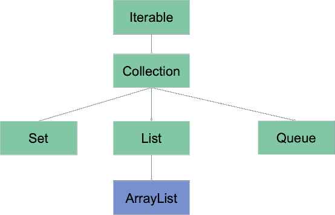
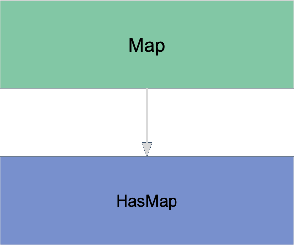
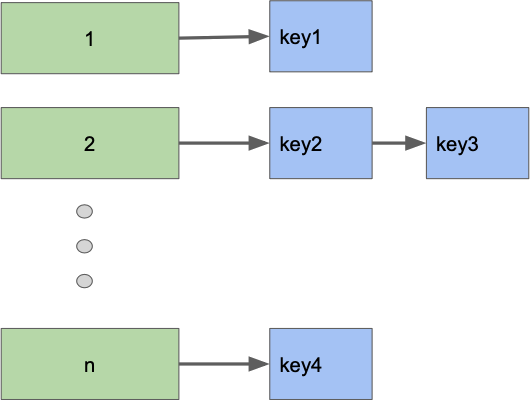

# Übersicht: Montag

-   Wiederholung der Freitagsaufgabe
-   Klassen / Objekte

---

# Wiederholung Freitagsaufgabe

---

# Klassen / Objekte

---

## Klasse

Kapselung von Logik und Daten.

```Java
class Student {
  // body
}
```

---

<!-- _class: hsplit -->

## Objekt

-   wird aus einer Klasse erstellt
-   die Klasse ist die Vorlage des Objekts
-   Objekte sind Referenztypen

```Java
class Student {
  // body
}

// in main
Student student = new Student();
```

---

<!-- _class: hsplit -->

## Variablen

Objekte können Variablen enthalten.

```Java
class Student {
    String name = "Name";
}

// in main
Student student = new Student();

System.out.println(student.name);
```

---

<!-- _class: hsplit -->

## Methoden

Objekte können Methoden enthalten.

```Java
class Student {
    String name = "Name";

    String getName(){
        return name;
    }
}

// in main
Student student = new Student();

System.out.println(student.getName());
```

---

<!-- _class: hsplit-->

## Getter/Setter

-   `private` Variablen sind nur innerhalb des Objekts sichtbar
-   Zugriff und Änderung über "getter" und "setter" Methoden

```Java
class Student {
    private String name = "Name";


    String getName(){
        return name;
    }

    void setName(String name){
        this.name = name;
    }
}

// in main
Student student = new Student();

System.out.println(student.getName());
```

---

<!-- _class: hsplit-->

## this

Referenz auf Objectscope.

```Java
class Student {
    private String name = "Name";


    String getName(){
        return name;
    }

    void setName(String name){
        this.name = name;
    }
}

// in main
Student student = new Student();

System.out.println(student.getName());
```

---

## Aufgabe: Klassen 1

1. Lege eine Klasse `Student` an und überlege dir drei Eigenschaften
2. Schreibe Methoden um die Eigenschaften zu setzen und abzufragen
3. Schreibe für jede Methode einen Test

---

<!-- _class: hsplit-->

## Konstruktor

-   Initialisierung des Objekts
-   wird einmalig beim Erzeugen aufgerufen
-   Name des Konstruktors = Name der Klasse

```Java
class Student {
    private String name;

    Student(String name){
        this.name = name;
    }

    String getName(){
        return name;
    }

    void setName(String name){
        this.name = name;
    }
}

// in main
Student student = new Student("Frank");

System.out.println(student.getName());
```

---

<!-- _class: hsplit-->

## packages

-   Ordnerstruktur im Projekt
-   Strukturierung und Kapselung des Projekts

```Java
// file:AppMain.java
import model.Student;

class AppMain {

  public static void main(String[] args) {
    Student student = new Student("name");
    System.out.println(student.getName());
  }
}

//file: model/Student.java
package model;

class Student {
    private String name;

    public Student(String name){
        this.name = name;
    }

    public String getName(){
        return name;
    }

    public void setName(String name){
        this.name = name;
    }
}
```

---

<!-- _class: hsplit-->

## Sichtbarkeiten

-   `private`
    -   nur in eigener Klasse
    -   wenn möglich immer private
-   `protected`
    -   Klassen im gleichen Paket (Ordner)
    -   Kindklassen (später)
    -   eher selten verwendet
-   `public`
    -   Global sichtbar
    -   nur für öffentliche API

```Java
package model;

class Student {
    private String name;

    public Student(String name){
        this.name = name;
    }

    public String getName(){
        return name;
    }

    public void setName(String name){
        this.name = name;
    }
}

// in main
import model.Student;
Student student = new Student("name");
System.out.println(student.getName());
```

---

## Static

**statische** Eigenschaften der Klasse (Variablen & Methoden).

Nach Möglichkeit vermeiden, außer für Konstanten.

```Java
public static void main(String[] args) {
    // ...
}
```

---

## Aufgabe: Package

1. Verschiebe deine `Student` Klasse in ein `model` Package und passe die Sichtbarkeiten und Referenzen an
2. Schreibe eine Methode `toString` welche alle Eigenschaften eines Studenten als String zurückgibt
3. Schreibe für deinen `Student` Klasse einen Konstruktor und verwende ihn

---

## Objekt-Methoden

-   `equals`
    -   überprüft Objekt auf Gleichheit
-   `hashCode`
    -   generiert Hashwert für das Objekt
    -   Datenstrukturen (`HashMap`)
    -   immer überschreiben, wenn `equals` überschrieben wird
-   `toString`
    -   gibt Objekt als String aus

---

## Aufgabe: Objekt-Methoden

1. Implementiere für deine Klasse `equals` und `hashCode`
2. Nutze die `equals` Methode im Test

---

## Aufgabe: Random Student

Erstelle eine Klasse StudentDB mit folgenden Eigenschaften

1. Der Konstruktor nimmt ein Array von Studenten entgegen
2. Jeder Student hat einen Namen und eine Id
3. Die Methode `list` gibt alle Studenten zurück
4. Die Methode `toString()` gibt alle Studenten formatiert als String zurück
5. Die Methode `randomStudent()` gibt einen zufälligen Studenten zurück (Nutze für den Zufall `Math.random()`)

Schreibe für alle Methoden Tests (bis auf randomStudent() )

**Bonus**: Schreibe eine `add` und eine `remove` Methode, um Studenten hinzuzufügen und zu entfernen

---

# Übersicht Dienstag

-   Objektorientierung
-   Interfaces
-   Vererbung

---

# Objektorientierung

---

## Paradigmen

-   Encapsulation
-   Abstraction
-   Polymorphism
-   Inheritance

---

## Encapsulation

Kapselung von Logik & Daten.

---

## Polymorphism

-   Objekte können verschiedene Formen annehmen
-   Ergebnis eines Aufrufs hängt von der jeweiligen Form ab
-   Beispie: Student
    -   Informatik Student
    -   Chemie Student

---

## Inheritance / Vererbung

-   Objekte können voneinadern erben (Daten & Verhalten)
-   Beispiel: Informatik Student erbt alle Eigenschaften von Student
-   **Wichtig**: Das erbende Objekt muss sein Eltern-Objekt erweitern!
-   **Nicht** zum Code sparen!!

---

## Encapsulation in Java

-   Packages & Access modifier
-   Methoden
-   Klassen

---

<!-- _class: hsplit-->

## Abstraction in Java

-   Methoden beschreiben nur _was_, nicht _wie_
-   das _wie_ kann geändert werden, ohne andere Teile zu ändern
-   Interfaces abstrahieren konkrete Klassen

```Java
package model;

// Student
class Student {
    private String name;

    public Student(String name){
        this.name = name;
    }

    public String getName(){
        return name;
    }

    public void setName(String name){
        this.name = name;
    }
}
```

---

## Interface

-   `interface` definiert Signatur von Methoden
-   per default sind alle Methoden `public`
-   Klassen können (mehrere) Interfaces implementieren
-   Signatur muss übereinstimmen

```Java
public interface Student {
    String getCourse();
}

public class ComputerScienceStudent implements Student {
    public String getCourse() {
        return “Computer Science”;
    }
}
```

---

## Interface

Interfaces können den Typ einer Variablen angeben.

```Java
public interface Student {
    String getCourse();
}

public class ComputerScienceStudent implements Student {
    public String getCourse() {
        return “Computer Science”;
    }
}

// Object creation
Student student = new ComputerScienceStudent();

// Method parameter
static String printStudentCourse(Student student) {
    return "Course " + student.getCourse();
}
```

---

## Polymorphism

Student kann in verschiedenen Formen implementiert sein.

```Java
// Object creation
Student student = new ComputerScienceStudent();


// Method parameter
static String printStudentCourse(Student student) {
    return "Course " + student.getCourse();
}
```

---

## Aufgabe: Interface

1. Mache deine Student Klasse zu einem Interface
2. Füge eine Methode zu Student hinzu, die zwei Studenten (z.B. Informatik-/ Geschichtsstudent ) verschieden implementieren würden und schreibe die entsprechenden Klassen
3. Schreibe eine Methode die auf dem Interface das Ergebnis der Methode auf der Konsole ausgibt

---

<!-- _class: hsplit-->

## Vererbung

-   Beispiel: `Student` in verschiedener Form erweitert
-   alle Eigenschaften von `Student` hat auch `ComputerScience` Student
-   **Nicht nutzen** um Code zu sparen
-   Überschreiben von Funktionalität ebenfalls möglich

```Java
// file: Student.java
public class Student {
    //...

    public String getName() {
       return name;
    }
}

// file: ComputerScienceStudent.java
public class ComputerScienceStudent extends Student {
    public int getProgrammingSkill() {
       return programmingSkill;
    }
}
```

---

## Abstract

-   von `abstract` Klassen können keine Objekte direkt erzeugt werden
-   Klassen die `abstract` Klassen erweitern, müssen abstrakte Methoden implementieren oder ebenfalls abstract sein

```Java
public abstract class Student {
    // ...
    abstract String getCourse();

    public String getName() {
        return name;
    }
}

public class ComputerScienceStudent extends Student {
    public String getCourse() {
        return “Computer Science”;
    }
}
```

---

## Aufgabe: Vererbung

1. Mache aus deinem Student Interface eine Klasse und lasse zwei Klassen von dieser erben
2. Überlege was die Unterschiede zwischen der Verwendung eines Interfaces und Vererbung sind und schreibe vor und nachteile auf
3. Mache aus deiner Student Klasse eine Abstrakte Klasse mit einer Abstrakten Methode “anzahlModule”.

---

# Collections

---

## LinkedList

Element zeigt auf das nächste Element.


---

## Aufgabe: LinkedList

1. Schreibe eine Klasse `AnimalListItem` mit
    1. einer Variable `value` von Type `Animal`
    2. einer Variable `next` von Typ `AnimalListItem`
    3. einem Konstruktor mit `value` als Parameter
    4. eine Methode `add` die ein Element ans Ende anhängt
2. Schreibe eine Methode welche die Liste, wenn sie die Elemente a,b und c enthält wie folgt als String zurückgibt “a -> b -> c”
3. Implementiere eine Methode `remove` welche alle Elemente mit einem entsprechenden Wert entfernt.

Schreibe entsprechende Tests!

---

<!-- _class: hsplit-->

## Collections in Java

-   `Iterable` Interface
-   `ArrayList`
    -   `List` implementierung mit index
    -   `Generic<T>` spezifiziert den Typ der Objekte



---

<!-- _class: hsplit-->

## ArrayList

-   Implementiert `Iterable`
-   Generic Type
-   Zugriff über index möglich
-   hinzufügen über `add`
-   Länge über `size()`

```Java
// Erzeugen
ArrayList<Student> students =
  new ArrayList<Student>();

// Hinzufügen
students.add(
  new ComputerScienceStudent("Student")
);

// Zugriff
System.out.println(students.get(0));

// iterieren
for (Student student : students) {
     System.out.println(student.getName());
}
```

---

## Aufgabe: ArrayList

Ersetze in deiner StudentDB das Array durch eine `ArrayList`.

---

# Map

---

<!-- _class: hsplit-->

## Key-Value Datenstruktur

-   `Map` Interface
-   `HashMap`
-   `Generic<K,V>` spezifiziert den Typ des Keys/Values



---

<!-- _class: hsplit-->

## Verwendung Hashmap



```Java
// create map
Map<String, Student> mapOfStudents = new HashMap<>();

// add values
mapOfStudents.put("student1", student);
mapOfStudents.put("student4", student2);

// get values
Student studentFromMap = mapOfStudents.get("student4");
```

---

## Aufgabe: Map

-   Ersetzte in deiner Student Db die Liste durch eine Map
-   Überlege was für eine Map und was für eine Verwaltung in der Liste spricht

---

# Exceptions

---

## Exceptions

-   Wird bei unerwartetem, fehlerhaften Verhalten geworfen
-   beendet normalen Programmablauf

```Java
throw new RuntimeException( "Hier lief etwas schief!!");
```

---

<!-- _class: hsplit-->

## try / catch

-   Fängt Exception
-   Verhalten im Exception-Fall kann definiert werden

```Java
try{

    // Body

}catch (RuntimeException e){
    System.out.println(e);
}

```

---

## Runtime vs Checked Exceptions

-   Checked Exceptions
    -   müssen angegeben werden
    -   müssen behandelt werden
-   Runtime Exceptions
    -   können immer auftreten
    -   müssen nicht behandelt werden

```Java
public String method(int value) throws Exception{
    //...
```

---

## Aufgabe: Exceptions

1. Erweitere die add Methode der StudentDB um eine Prüfung, ob die id bereits in der Liste vorhanden ist und schmeiße in dem Fall eine Runtime Exception
2. Schreibe einen Test mittels try /catch der dieses Verhalten überprüft.

---

# Optionals

---

<!-- _class: hsplit-->

## Optional

-   `null` führt häufig zu Fehlern
-   `Optional` deutet auf optionalen Wert hin
-   Zugriff über Optional sicher

```Java
public Optional<Student> method(int value) {

//...

return Optional.of(student);

// ...

return Optional.empty();

// Zugriff

studentOptional.isPresent();


studentOptional.get()
```

---

## Aufgabe: Optional

Füge der StudentDB eine findByID Methode hinzu, die ein Optional als Rückgabewert hat.

Schreibe einen entsprechenden Test!

---

# forEach

---

## For each

-   Iterieren über Iterable
-   ausführen von Aktionen auf allen Objekten

```Java
students.forEach(student -> {
    // do something
});
```

---

## Aufgabe: For each

Schreibe in deiner StudentDB eine Methode printIds welche alle Ids auf der Konsole ausgibt. Nutze anstelle eine for schleife foreach.

---

# Freitagsaufgabe

Schreibe ein Bestellsystem (**mit Tests!**).


---

# Freitagsaufgabe

Schreibe ein Bestellsystem (**mit Tests!**).

1. Verwalte zu bestellende Produkte in einer `ProductDb` (muss nicht veränderbar sein)
2. Gebe alle Produkte in der `AppMain` aus
3. Verwalte Bestellungen über eine `OrderDb`
4. Füge eine Bestellung über einen `OrderService` hinzu
5. Gebe alle Bestellungen aus
6. nutze für die `get` Methoden als Rückgabewert ein `Optional`
7. `throw` eine Exception wenn Produkte bestellt werden sollen die nicht existieren
8. Nutze anstelle einer `Product` Klasse ein Interface und implementiere verschiedene Ausführungen

---

# Freitagsaufgabe: Bonus

Mache aus deiner OrderDb ein Interface und 2 Implementierung

-   eine Version, welche die Bestellungen wie zuvor im Speicher hält
-   eine Version, welche den Jackson-ObjectMapper nutzt um Bestellungen auf die Festplatte zu speichern
-   schaue dir `hamcrest` an
-   Nutze in deiner `AppMain` einen `Scanner` um interaktiv zu bestellen
