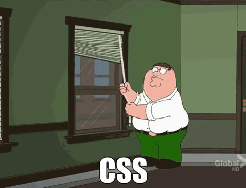

# Fontend intro

---

## Wochenübersicht

Montag: HTML, CSS intro
Dienstag: CSS: flex & grid, JavaScript intro
Mittwoch: Create react app, functional components, data flow
Donnerstag: useState, useEffect, api requests, form handling
Freitag: Build your first app

---


---
# HTML


- **H**yper**t**ext **M**arkup **L**anguuage
- Auszeichnungsprache
- beschreibt den Inhalt einer Seite
- XML ähnliche Tags
- 
    ```html
    <h1>Fancy heading</h1>
    ```

---

# CSS

- **C**ascading **S**tyle **S**heets 


---
# JS

- **J**ava**S**cript oder ECMA-Script

- Standartisierte Versionen, ES2020, ESNext

- schwach typisierte, dynamische Skriptsprache


---