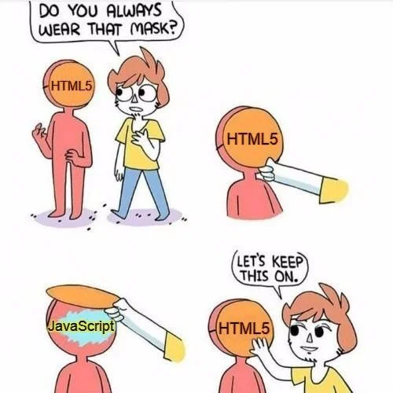

# Fontend intro

---

## Wochenübersicht

**Montag:** Besprechung Freitagsaufgabe, HTML, CSS intro, Layout: flexbox & grid

**Dienstag:** JavaScript, Array-Methoden, Netzwerkrequests, Promises & async/await

**Mittwoch:** Create react app, functional components, Data flow, Formulare

**Freitag:** Kanban Frontend

---


---

# **H**yper**t**ext **M**arkup **L**anguuage



- Auszeichnungsprache
- beschreibt den Inhalt einer Seite
- XML ähnliche Tags
- `<h1>Fancy heading</h1>`
- Let's explore some HTML on [mdn](https://developer.mozilla.org/en-US/docs/Learn/HTML/Introduction_to_HTML/Getting_started)

---

## Website tooling

- **npm** node package manager, kommt mit node Installation
- `npm init` - legt ein neues npm project an
- `npm install --save-dev vite` - installiert vite bundler
- start script in `package.json` hinzufügen
    ```json
        "start": "vite",
    ```
- `index.html` anlegen
- `npm run start` & BÄM Hot-Reloading

---

## Aufgabe: Personal Blog
- Erstelle einen Blog
- Wird ohne CSS etwas grotesk aussehen, ist aber okay. Wir konzentrieren uns auf korrekte Verschachtelung und Semantik
- www.allthetags.com hilft dir die passenden Tags zu finden ;)  


---

# **C**ascading **S**tyle **S**heets 


---
## CSS-Dateien

Einbinden über `link` Tag im `head` des html Dokuments.

```html
    <link rel="stylesheet" href="css/style.css">
```

**Alternativen:**

- `style` Tag im `head` (gut um FOUC zu verhindern)
- inline über `style` Attribut von HTML Elementen (beste Performance, aber hohe Maintenance-Kosten, nur unbedingt notwendig) 

---

<!-- _class: hsplit-->
## Rulesets

**Selectors** wählen 1 oder mehrere Elemente aus und wenden darauf verschiedene **Rules** an.

```css
body {
    font-size: 112.5%;
    font-family: sans-serif;
    background: #333;
    color: whitesmoke;
}

.box {
    width: 100px;
    height: 100px;
    background: hotpink;
    border: 25px solid limegreen;
}

.border-box{
    box-sizing: border-box;
}

.content-box{
    box-sizing: content-box;
}
```

---

## Selectors: Let's play a game

Spiele das köstliche [CSS Diner](https://flukeout.github.io/) um dich mit den verschiedenen Selektoren vertraut zu machen!

Wenn du nicht weiterkommst: [mdn is dein Freund](https://developer.mozilla.org/en-US/docs/Web/CSS/CSS_Selectors)

---

## Layout I: Alles auf die Reihe kriegen (Flexbox)

Spiele  https://flexboxfroggy.com/ um dich mit flexbox vertraut zu machen.

- https://css-tricks.com/snippets/css/a-guide-to-flexbox/

---

## Layout II: Hinter Gittern (Grid)

Lerne grid layout mit https://cssgridgarden.com/

- https://css-tricks.com/snippets/css/complete-guide-grid/

---

## Aufgabe: Blog stylen 🌈

Verpasse deinem Blog ein Layout und ordentlich Farbe!

Placeholder für die Bilder findest du bei

- https://source.unsplash.com/200x400?capybara

