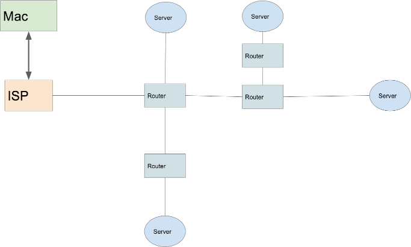

# Woche 1

- Montag, Start: Kennenlernen, Shell basics, Git Start
- Dienstag, Java Start: Git basics, Web Architektur, Java start
- Mittwoch, Testing: Java Method basics, Maven start, JUnit Tests schreiben
- Donnerstag, Java Controlflow: Java Controlflow, Controlflow testen, Arrays
- Freitag, Praxis-Tag: Anwendung der erlernten Inhalte, schreiben und versionieren einer getesteten Passwortvalidierung

---

## Mac

- Trackpad kann über Settings konfiguriert werden
- Shortcuts
- cmd+c, cmd+v => copy paste
- cmd+space => spotlight
- Finder => Datei explorer

---

## Slack

- [Channel commands](https://slack.com/intl/de-de/help/articles/201259356-Slash-Befehle-in-Slack)
- ping
- @here an alle online user
- @channel an alle user
- @jan an einen bestimmten User

---

## Was ist ein Programm?

- Anweisung an den Computer
- Vergleichbar mit einer Gebrauchsanleitung
- natürliche Sprache ist ungenau
- Programmiersprachen beschreiben genau was der Computer machen soll

---

# Shell

---

## Shell Basics

- [Cheat sheet](https://github.com/LeCoupa/awesome-cheatsheets/blob/master/languages/bash.sh)

- Unix-syntax: `<command> --<option> <parameter>`

| Befehl                 |                                            |
| ---------------------- | ------------------------------------------ |
| `pwd`                  | Pfad des aktuellen Ordners                 |
| `ls`                   | Dateien im Ordner ausgeben                 |
| `cd path/to/something` | In den Ordner `path/to/something` wechseln |
| `cd ..`                | In den nächsthöheren Ordner wechseln       |
| `echo "Hey"`           | Gibt "Hey" aus                             |
| `mkdir my-folder`      | Legt den Ordner `my-folder` an             |
| `rm -rf my-folder`     | Löscht `my-folder` und alle Unterordner    |
| `sh ./script.sh`       | Führt das Skript `script.sh` aus            |

---

## Sh scripts

- Befehlsabfolge automatisieren
- Dateiendung .sh

1. Script erstellen, indem Ausgabe in Datei umgeleitet wird (`>>`)

   ```shell
   echo “echo Hallo” >> script.sh
   ```

2. Ausführen

   ```shell
   $ sh ./script.sh
   ```

3. Executable machen

   ```shell
   $ chmod +x script.sh
   $ ./script.sh
   ```

---

## Aufgaben: Shell

1. Mach dich mit der Shell vertraut, indem du über die shell
   - einen Ordner für zukünftige Projekte anlegst
   - neue Unterordner anlegst und wieder löscht
2. Schreibe ein Skript das “Hallo World” ausgibt
3. Erweiter das Skript um eine Nutzereingabe mittels der folgenden Zeilen und versuche die Funktion nachzuvollziehen

   ```shell
   echo Hallo wer bist du?
   read varname
   echo Hallo $varname
   ```

4. Installiere brew über das Terminal

   ```shell
   /bin/bash -c "$(curl -fsSL https://raw.githubusercontent.com/Homebrew/install/HEAD/install.sh)"
   ```

---

# Git

---

## Versionierung mit Git

- Dateien eines Ordners versionieren
- Versionen wieder herstellen
- Zwischen Versionen wechseln
- Versionen mit anderen Entwicklern teilen
- Frage: Was würde passieren, wenn wir kein Git und keine Versionierung verwenden würden?

[Video: Git Basics](https://www.youtube.com/watch?v=8oRjP8yj2Wo)

[Offizielle Git-Doku](https://git-scm.com/book/de/v2)

---

# Git local

---

## Repository

Ordner mit Versionsverwaltung. Der _root_ - Ordner des Projekts.
---

## Commit

Eine Version aller Dateien im Repository.

- Id
- Dateiänderungen
- Nutzer
- Nachricht
- Referenz auf die vorherige Version
- Zeitstempel

---

## Tree

Ein Commit verweist auf einen vorherigen Commit, hierdurch entsteht eine Baumstruktur.

- Versionsverlauf
- Kann mehrere Pfade haben
- Pfade zeigen immer in eine Richtung

---

## Head

Head-Label zeigt auf momentane Ordnerversion

- Durch Auschecken einer anderen Version wird der Head verschoben

---

## Branch

verschiebbares Label

- Verweist auf einen commit
- Der Standard-Branch wird meist **main** oder **master** genannt
- Vereinfacht die Navigation im Baum
- Meistens wird ein checkout von Branches gemacht
- Entwickelt wird auf einem Branch


---

## Branch Commit Workflow

1.  Commit von Änderungen
2.  Head-Label verschieben
3.  Branch-Label verschieben

---

## Repository anlegen

```shell
git init
```

- Erzeugt ein neues Repository
- `.git` Ordner wird erstellt

---

## Repository Status

```shell
git status
```

Zeigt den Status des Repository an

- Änderungen
- Untracked files (Dateien, die noch nicht "gestaged" sind)
- Momentane Branch
- Vorschläge für Aktionen

---

## Staging

Einzelne File:

```shell
git add <somefile>
```

Alle Files:

```shell
git add .
```

Commit “zusammenbauen”, indem mehrere Änderungen zusammengefasst werden.

---

## Commit

```shell
git commit -m “A message”
```

Erstellt eine commit id und bewegt **branch** und **head**.

---

## Aufgabe: git commit

1. Installiere Git (brew install git)
2. Setze deine Nutzerinfo
3. Erstelle ein Repository
4. Füge dein sh script hinzu
5. Mache einen commit deiner Datei
6. Installiere ein grafisches git tool (z.B. brew cask install sourcetree)
7. Ändere die Datei
8. Erstelle einen weiteren commit

---

# Übersicht Dienstag

- Protocol
- Git Branch
- Git Remote
- Markdown
- Web-Einführung
- Java Intro

---

# Git

---

## Branch erstellen

Liste aller branches anzeigen

```shell
git branch
```

Branch mit Namen `<somebranch>` erstellen

```shell
git branch <somebranch>
```

---

## Branch auschecken

```shell
git checkout <some-branch-name>
```

Setzt den aktuellen Branch und Head auf den commit der branch

---

## Merge Workflow

```shell
git merge <some-branch-name>
```

- Fügt Änderungen zusammen
- Erstellt einen merge commit (wenn nötig)
- Verschiebt head und branch label
- Merge-Konflikte müssen gelöst werden und durch `git add` hinzugefügt werden

---

## Aufgabe: git branch

1. Erstelle einen Branch
2. Ändere dein sh Skript
3. Mache einen commit deiner Änderungen
4. Merge deine Änderungen
5. Lösche den Branch

---

# Git remote

---

## remotes

- Referenz auf ein anderes git repository
- local ist eine Kopie des remote repository
- pull holt Änderungen vom remote repo
- push sendet Änderungen zum remote repo

---

## clone

Eine Kopie vom remote Repository erstellen

```shell
git clone <uri>
```

---

## pull

Holt Änderungen vom remote

```shell
git pull
```

---

## push

```shell
git push
```

Sendet Änderungen Richtung remote

---


---

## Git workflow (Feature branch)

1.  pull main
2.  checkout main
3.  branch von main erzeugen (feature branch)
4.  entwickeln auf branch (commit & push to branch)
    - checkout main & pull
    - checkout feature & merge main in feature
5.  merge request/pull request erstellen
6.  nach Review in main mergen
7.  feature branch löschen

---

## Github

[Github](https://github.com/)

- hosted git version control system
- meist genutzt für Open Source
- von Microsoft 2018 für 7,5 Milliarden $ gekauft
- Hilft beim Einstieg: https://lab.github.com/


---

## Aufgabe: Github

1. Lege dir einen GitHub-Account an
2. Erstelle einen SSH key ( ssh-keygen)
3. Trage den public key in GitHub ein
4. Lege ein GitHub-Projekt an
5. Setze das remote repository als remote und push deine Änderungen
6. Erstelle eine branch
7. Mache eine Änderung und committe und pushe sie
8. Erstelle einen Pull request
9. Akzeptiere den Pull request

---

# Webapp Architektur

---

<!-- _class: hsplit-->

## Wie funktioniert das Internet?

- [Short intro](https://www.youtube.com/watch?v=7_LPdttKXPc)
- Netzwerk aus Servern
- Server bekommen IP Adressen



---

## Webanwendung


---

# Java Basic Intro

---

## Herkunft

- 1995 aus C++ entstanden
- von Oracle entwickelt nach der Übernahme von Sun

---

## Plattformunabhängig


---

## Installieren

[Installieren mit Brew](https://formulae.brew.sh/formula/openjdk)

```shell
brew install openjdk
```

java check:

```shell
java -version
```

---

## Entwicklungsumgebung

- Intellij
- Community kostenlos
- Ultimate kostet
- Framework und JavaScript Unterstützung
- Eclipse als Alternative
- Visual Studio Code

---

## Erstes Programm "Hallo Kurs"

Der Programmeinstieg ist die `main`-Method und eine Ausgabe auf der Konsole mit `System.out.println`

```java
public class AppMain {
  public static void main(String[] args) {
    System.out.println("Hallo Kurs!");
  }
}
```

---

## Programm laufen lassen

```shell
javac AppMain.java
```

**javac** Compiler nutzen, um ein class file zu erzeugen

```shell
java AppMain
```

führt die main Methode auf der JVM aus

---

## Aufgabe: Java Intro

1. Installiere Java
2. Installiere Intellij
3. Schreibe dein erstes Programm
4. Führe dein erstes Programm aus
5. Ändere den ausgegebenen Text

---

# Datentypen

- Daten sind Informationen
- Programme arbeiten auf Basis von Daten/Informationen
- Datentypen nutzen eine definierte Speichermenge

---

## Datentyp String

- Zeichenkette, z.B. “Hallo Kurs”
- kann nicht verändert werden
- Änderung führt zu neuem String

---

<!-- _class: hsplit-->

## Variable

- Referenz auf einen Speicherbereich
- können Werte zugewiesen werden
- kann ausgelesen werden
- System.out.println(variable);
- Java ist **streng** typisiert
- beim Anlegen muss der Type angegeben werden (muss eindeutig sein)
- Variablen können nur passenden Typen zugewiesen werden

```Java
String someVariable;
someVariable = "Hallo Kurs!";

System.out.println(someVariable);

String anotherVariable = "Hallo Kurs!";

System.out.println(anotherVariable);
```

---

## Datentyp boolean

- kann nur zwei Werte haben `true` oder `false`
- andere Werte führen zu einem Compilerfehler

```java
boolean boolValue = true;

System.out.println(boolValue);
```

---

## Datentyp int (Integer)

- Ganzzahlwerte zwischen -2<sup>31</sup> bis 2<sup>31-1</sup>
- Speicherbedarf: 32 Bits

---

<!-- _class: hsplit-->

## Integer Operatoren

- `+` Addition
- `-` Subtraction
- `*` Multiplikation
- `/` Division
- `%` Modulo

```java
int intValue = 3 + 4;

int result = intValue + 7;

System.out.println(result);
```

---

## String Operatoren

- Strings können mittels `+` zu neuen `String`s vereint werden
- Strings können mit anderen Werten zu neuen `String`s vereint werden, z.B. wird `Integer` mittels Cast zu `String`

```java
String result = "text" + "zusammen";

String castResult = "Ergebnis" + 9;
```

---

## Aufgabe: Operatoren

1. Lege zwei Variablen mit `int` Werten an
2. Addiere die Werte und gib sie auf der Konsole aus
3. Führe den `String` “Summe: “ mit der Ergebnisvariable zusammen und
   gib ihn aus

---

# Übersicht Mittwoch

- Protocol
- Methoden
- Testing
- Maven

---

<!-- _class: hsplit-->

# Primitive Typen

- byte (sehr kleine ganzzahlige Werte)
- short (kleine ganzzahlige Werte)
- int (ganzzahlige Werte)
- long (große ganzzahlige Werte)
- float (kleine Fließkommawerte)
- double (Fließkommawerte)
- char (einzelnes, druckbares Zeichen)
- boolean (Wahrheitswert)

```java
byte someByte = 113;

short someShort = 30000;

int someInt = 300000;

long someLong = 3000000000L;

float someFloat = 300000000000000.0f;

double someDouble =
  3000000000000000000000000000.20003;

char someChar = 'a';

boolean someBoolean = false;
```

---

# Relationale und Gleichheitsoperatoren

- `==`, `!=`, `<`, `>`, `<=`, `>=`
- nur auf primitiven Typen möglich
- Typen werden von einem in den anderen Typen “überführt” (Casting)

```java
boolean result = someInt < someOtherInt;
```

---

## Aufgabe: Relational Operatoren

1. Lege zwei Variablen mit `int` Werten an
2. Prüfe die Werte auf
   - größer
   - kleiner
   - Gleichheit
3. Gib das Ergebnis aus

---

# Methoden

---

<!-- _class: hsplit-->

## Methoden

- kapseln Logik
- Eingabe Parameter und Rückgabe Parameter
- Wiederverwendbar


---

<!-- _class: hsplit-->

## Methoden

```java
// Definition
public static int duplicate(int value){
  return value * 2;
}


// Aufruf
int result = duplicate(3);
```

- public: Sichtbarkeit (später)
- static: statisch (später)
- int dup...: Rückgabetyp
- `duplicate`: Name der Methode
- `int value`: Eingabeparameter
- { Funktions-Code}
- `return`: Rückgabe von Ergebnis

---

## Aufgabe: Methoden 1

1. Schreibe eine Methode, die zwei `int` Parameter entgegennimmt und die Summe dieser zurückgibt
2. Schreibe eine 2. Methode, die einen `int` Parameter entgegennimmt und einen `String` `“Summe : <int-parameter>”` zurückgibt.
3. Führe beide Methoden in der main-Methode nacheinander aus und gib den String auf der Konsole aus

**Bonus**: Prüfe, ob einer der `int` Werte größer als 100 ist.

---

## String Methoden

- Aufruf von vordefinierten Methoden auf String
- Methodenaufruf auf _nicht primitiven_ Datentypen möglich

```java
someString.contains("test")
```

---

## Aufgabe: String Methoden

Schreibe eine Methode, die prüft, ob ein String

1.  länger als 20 Zeichen ist
2.  die Zeichenfolge "fancy" enthält

---

# Testing / JUnit

---

## Motivation

Sicherstellen von korrektem Verhalten der Anwendung

- bei der Entwicklung von neuen Features
- nach Änderungen des Codes

---

# Maven

---

## Project Management

- pom.xml (Projekt Konfiguration)
- project object model (pom)
- dependencies
- build process

Archetyp für default Setup:

```xml
<project>
  <modelVersion>4.0.0</modelVersion>
  <groupId>de.neuefische</groupId>
  <artifactId>maven-example</artifactId>
  <version>1.0-SNAPSHOT</version>
.....
</project>
```

---

## Maven Befehle

- führen ein maven Script aus, Syntax: `mvn <command>`
- führen in der pom.xml spezifizierten Prozess aus

| Befehl    | Effekt                                                                   |
| --------- | ------------------------------------------------------------------------ |
| `compile` | Kompiliert den Code zu einem target ordner                               |
| `test`    | führt mvn compile und tests aus                                          |
| `package` | führt mvn test aus und Packt den java code in eine jar im target ordner  |
| `install` | führt mvn package aus und fügt das jar file dem lokalen repository hinzu |
| `clean`   | entfernt den target ordner                                               |

---

## Aufgabe: Maven

1. Setze ein Maven Projekt auf
2. lasse die main Methode laufen
3. baue dein Projekt

---

# Testing / JUnit

---

## Motivation

Sicherstellen von

- Verhalten bei/nach dem Implementieren
- Verhalten nach Änderungen
- Fehler können teuer sein z.B. [Ariane 5 Flight 501](https://www-users.math.umn.edu/~arnold/disasters/ariane.html)
  - 8 Milliarden Dollar
  - 64-bit nummer in einem 16-bit Feld

---

# J-Unit

- Meist genutztes Unit-Testing Framework
- stellt Funktionalität bereit, um einfach Tests zu schreiben
- Integration in Entwicklungsumgebung

---

<!-- _class: hsplit-->

## J-Unit Test

- Eigene Datei für Tests
- Methoden definieren einen Test mit `@Test` Annotation
- Bedingungen werden mit asserts verifiziert

```java
@Test
public void shouldAnswerWithTrue()
{
     assertTrue( true );
 }
```

---

## Aufgabe: J-Unit

Schreibe Unit-Tests für

1.  deine Addieren-Methode
2.  eine Methode die prüft, ob ein Wert größer als 100 ist

---

# Control-flow

---

## Veränderung des Programmverlaufs basierend auf Daten

- if /else
- switch
- for
- while

---

## if else

Abzweigungen und bedingte Ausführung

```java
if (i > 0){
  // dann...
} else {
  // sonst...
}
```

---

## Aufgabe: Alarm

Schreibe eine Funktion die überprüft, ob zu viele Personen im Laden sind

1. Wenn die Anzahl über 30 liegt, gib den String “Zu viele Personen zurück”
2. Wenn die Anzahl unter 30 liegt, gib den String “Maximale Personenzahl
   nicht überschritten” zurück

Überlege dir zunächst die Methodensignatur

Schreibe **erst** einen Test und dann die entsprechende Funktionalität

---

<!-- _class: hsplit-->

## Switch

- Control-flow auf Basis von festen Werten
- `case` Werte: `int`, `String`, `enum`
- `break` beendet switch statement
- **wichtig**: ohne `break` oder `return` wird nächster case ausgeführt (fall through)
- `default`: wenn kein case zu trifft

```java
switch (i){
  case 3:
    System.out.println("3");
    break;
  case 4:
    System.out.println("4");
    break;
  default:
    System.out.println("anderer Wert");
    break;
}
```

---

## Aufgabe 2: Alarm

Erweitere deine Alarmfunktion um einen Parameter "Alarmstufe"

- Alarmstufe “rot”: keine Personen erlaubt
- Alarmstufe “gelb”: max 30 Personen erlaubt
- Alarmstufe “grün”: max 60 Personen erlaubt

Passe deine vorhandenen Tests an.

Schreibe jeweils **erst** einen Test und dann die entsprechende Funktionalität

---

## for

```java
for(int i = 0; i< 100; i++){
  // code runs 100 times
}
```

- `i=0` => Initialisierung
- `i < 100` => Abbruchbedingung, bei der Schleife beendet wird
- `i++` => bei jedem Durchlauf wird i um 1 erhöht
- wenn `i` größer gleich 100 wird die Schleife nicht mehr
  ausgeführt
- `i` sollte in der Schleife nicht verringert werden => Gefahr von Endlosschleifen

---

## Aufgabe: Fakultät

Schreibe eine Funktion, welche die Fakultät einer Zahl berechnet. Nutze dafür eine for Schleife.

Starte mit den Tests für folgende Fälle

1. 0! = 1 = 1
2. 1! = 1 \* 1 = 1
3. 2! = 1 \* 1 \* 2 = 2
4. 3! = 1 \* 1 \* 2 \* 3 = 6

---

## while

```java
while(isNiceWeather()){
  // ...code
}
```

- beliebige Bedingung
- `true` => Schleife wird ausgeführt
- `false` => Schleife wird nicht weiter ausgeführt

---

## Aufgabe: Fakultät while

Schreibe die Fakultätsfunktion mithilfe einer `while` Schleife. Nutze die vorhandenen Tests.

---

<!-- _class: hsplit-->

## Rekursion

- Methode ruft sich selbst auf
- Verkleinerung des Problems pro Aufruf
- Abbruch Bedingung muss vorhanden sein!
- Beispiel: Berechnung bei `value = 3`

  ```
  0 + 1 + 2 + 3 = 6
  ```

```java
public int calculateSum(int value){
  if(value < 1){
    return 0;
    }
  return calculateSum(value - 1) + value;
}
```

---

## Aufgabe: Fakultät Rekursion

Nutze Rekursion um die Fakultät zu berechnen.

---

# Arrays

---

<!-- _class: hsplit-->

## Sammlung von Elementen eines Typs

- Datenstruktur
- Feste Größe (Länge)
- Muss vor Verwendung erzeugt werden
- Zugriff und setzen von Werten über Index
- Index muss zwischen 0 und Arraylänge - 1 liegen
- **Achtung** bei nicht gesetztem Wert => `null`

```java
String[] someArray = new String[10];

someArray[0] = "value";

System.out.println(someArray[0]);
```

---

## Aufgabe: Arrays

1. Erstelle ein `String` Array und fülle es mit Werten
2. Nutze zum Befüllen des Arrays eine `for` Schleife. Die Werte sollen wie folgt aussehen `“Student <index>”`.

Nutze Tests, um die Funktionalität zu überprüfen

---

# CI <br/>(Continuos Integration)

---

<!-- _class: hsplit-->

## github actions

- ermöglicht Ausführen von Actions
- Tests können automatisiert laufen
- vor merge werden Tests ausgeführt
- Deployment kann automatisiert erfolgen

```yml
name: Build project with maven

on: push

jobs:
  build:
    runs-on: ubuntu-latest

    steps:
      - uses: actions/checkout@v2
      - name: Set up JDK 15
        uses: actions/setup-java@v2
        with:
          java-version: "15"
          distribution: "adopt"
      - name: Build with Maven
        run: mvn -B package --file pom.xml
```

---

# Aufgabe: Freitag

Schreibe eine Passwortvalidierung. Validiere, ob ein eingegebenes Passwort die Sicherheitsbestimmungen erfüllt oder nicht.

- Lege dir ein neues Java Github Projekt an
- Überlege dir, wie die Methoden aussehen müssen.
- Schreibe jeweils einen Test **und dann** die Funktionalität
  - Überprüfe erst die Länge des Passworts und
  - dann, ob Zahlen enthalten sind

**Bonus**:

- Checke, ob kleine/große Buchstaben enthalten sind
- Schaffe die Möglichkeit, eine Liste von Passwörtern zu validieren
- Schaue dir auf GitHub Labs weitere Einsteigervideos an
