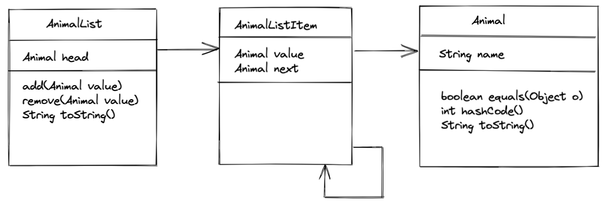
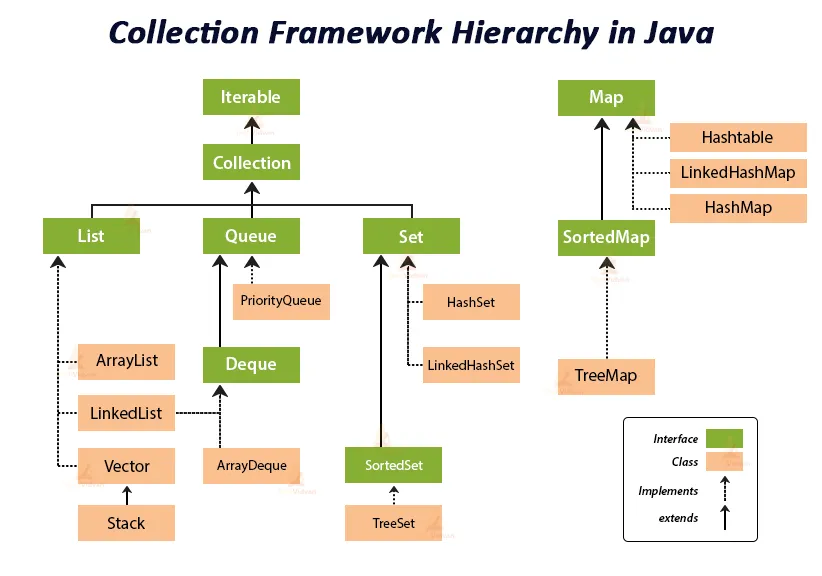
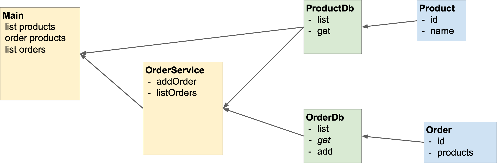

# Übersicht: Montag

- Wiederholung der Freitagsaufgabe
- Klassen / Objekte
  

- Weitere Erklärungen und Übungen zu Java und OOP: https://www.w3schools.com/java/java_oop.asp

---

# Wiederholung Freitagsaufgabe

---

# Klassen / Objekte

---

## Klasse

- Kapselung von Logik und Daten.
- Ein abstraktes "Modell der Realität"

```Java
class Student {
  // body
}
```

---

<!-- _class: hsplit -->

## Objekt

- wird aus einer Klasse erstellt
- die Klasse ist die Vorlage des Objekts
- Objekte sind Referenztypen


- Ein Objekt hat immer: 
  - Namen
  - Zustand
  - Verhalten

```Java
class Student {
  // body
}

// in einer anderen Methode
Student student = new Student();
```

---

<!-- _class: hsplit -->

## Variablen

Objekte können Attribute enthalten. Attribute sind quasi Variablen, die zu einer Instanz gehören.

```Java
class Student {
    String name = "Name";
}

// in einer anderen Methode
Student student = new Student();

System.out.println(student.name);
```

---

<!-- _class: hsplit -->

## Methoden

Objekte können Methoden enthalten.

```Java
class Student {
    String name = "Name";

    String getName(){
        return name;
    }
}

// in einer anderen Methode
Student student = new Student();

System.out.println(student.getName());
```

---

<!-- _class: hsplit-->

## Getter/Setter

- `private` Variablen sind nur innerhalb der Klasse sichtbar
- Zugriff und Änderung über "getter" und "setter" Methoden

```Java
class Student {
    private String name = "Name";


    String getName(){
        return name;
    }

    void setName(String name){
        this.name = name;
    }
}

// in einer anderen Methode
Student student = new Student();

System.out.println(student.getName());
```

---

<!-- _class: hsplit-->

## this

Referenz auf Objectscope.

```Java
class Student {
    private String name = "Name";


    String getName(){
        return name;
    }

    void setName(String name){
        this.name = name;
    }
}

// in einer anderen Methode
Student student = new Student();

System.out.println(student.getName());
```

---

## Aufgabe: Klassen 1

1. Lege eine Klasse `Student` an und überlege dir drei Eigenschaften
2. Schreibe Methoden, um die Eigenschaften zu setzen und abzufragen
3. Schreibe für jede Methode einen Test

---

<!-- _class: hsplit-->

## Konstruktor

- Initialisierung des Objekts
- wird einmalig beim Erzeugen aufgerufen
- Name des Konstruktors = Name der Klasse

```Java
class Student {
    private String name;

    Student(String name){
        this.name = name;
    }

    String getName(){
        return name;
    }

    void setName(String name){
        this.name = name;
    }
}

// in einer anderen Methode
Student student = new Student("Frank");

System.out.println(student.getName());
```

---

<!-- _class: hsplit-->

## packages

- Ordnerstruktur im Projekt
- Strukturierung und Kapselung des Projekts

```Java
// file:AppMain.java
import model.Student;

class AppMain {

  public static void main(String[] args) {
    Student student = new Student("name");
    System.out.println(student.getName());
  }
}

//file: model/Student.java
package model;

class Student {
    private String name;

    public Student(String name){
        this.name = name;
    }

    public String getName(){
        return name;
    }

    public void setName(String name){
        this.name = name;
    }
}
```

---

<!-- _class: hsplit-->

## Sichtbarkeiten (Access Modifiers)

|     Modifier    |     Class    |     Package    |     Subclass    |     World    |
|-----------------|:------------:|:--------------:|:---------------:|:------------:|
| public          | ✅           | ✅              | ✅              | ✅            |
| protected       | ✅           | ✅              | ✅              | ❌            |
| (no modifier)   | ✅           | ✅              | ❌              | ❌            |
| private         | ✅           | ❌              | ❌              | ❌            |

  
```Java
package model;

class Student {
    private String name;

    public Student(String name){
        this.name = name;
    }

    public String getName(){
        return name;
    }

    public void setName(String name){
        this.name = name;
    }
}

// in einer anderen Methode
import model.Student;
Student student = new Student("name");
System.out.println(student.getName());
```

---

## Static

**statische** Eigenschaften der Klasse (Variablen & Methoden).

Nach Möglichkeit vermeiden, außer für Konstanten.

```Java
public static void main(String[] args) {
    // ...
}
```

---

## Aufgabe: Package

1. Verschiebe deine `Student` Klasse in ein `model` Package und passe die Sichtbarkeiten und Referenzen an
2. Schreibe eine Methode `toString` welche alle Eigenschaften eines Studenten als String zurückgibt
3. Schreibe für deinen `Student` Klasse einen Konstruktor und verwende ihn

---

## Objekt-Methoden

- `equals`
  - überprüft Objekt auf Gleichheit
- `hashCode`
  - generiert Hashwert für das Objekt
  - Datenstrukturen (`HashMap`)
  - immer überschreiben, wenn `equals` überschrieben wird
- `toString`
  - gibt Objekt als String aus

---

## Aufgabe: Object-Methoden

1. Implementiere für deine Klasse `equals` und `hashCode`
2. Nutze die `equals` Methode im Test

---

<!-- _class: hsplit -->

## Records

- Seit Java 14 Bestandteil der Sprache
- Records sind wie Klassen, mit der Ausnahme, dass sie nicht verändert werden können (immutability)
- `hashCode`, `equals` und `toString` werden automatisch generiert

```java
package model;

record Student(String firstname, String lastname) {

    public String fullName() {
        return firstname + " " + lastname;
    }
}

// in einer anderen Methode
var student = new Student("Jane", "Doe");
System.out.println(student.firstname()); // Jane
System.out.println(student.lastname());  // Doe
System.out.println(student.fullName());  // Jane Doe

System.out.println(student.hashCode()); // z.B. 71408012
System.out.println(student.equals(new Student("Jane", "Doe"))); // true
System.out.println(student.equals(new Student("John", "Doe"))); // false
System.out.println(student.toString()); // Student[firstname=Jane, lastname=Doe]
```

---

<!-- _class: hsplit -->

## Wie ändere ich den Namen?

```java
record Student(String firstname, String lastname) {

    public Student changeFirstname(String newFirstname) {
        return new Student(newFirstname, lastname);
    }

    public Student changeLastname(String newLastname) {
        return new Student(firstname, newLastname);
    }

    public String fullName() {
        return firstname + " " + lastname;
    }
}
```

```java
// in einer anderen Methode
var student = new Student("Jane", "D.");
System.out.println(student.firstname()); // Jane
System.out.println(student.lastname());  // D.
System.out.println(student.fullName());  // Jane D.

student = student.changeLastname("Doe");
System.out.println(student.firstname()); // Jane
System.out.println(student.lastname());  // Doe
System.out.println(student.fullName());  // Jane Doe

var newStudent = student.changeFirstname("Mary");
System.out.println(newStudent.firstname()); // Mary
System.out.println(newStudent.lastname());  // Doe
System.out.println(newStudent.fullName());  // Mary Doe

System.out.println(student.firstname());    // Jane
System.out.println(student.lastname());     // Doe
System.out.println(student.fullName());     // Jane Doe
```

---

## Aufgabe: Random Student

Erstelle eine Klasse StudentDB mit folgenden Eigenschaften

1. Der Konstruktor nimmt ein Array von Studenten entgegen
2. Jeder Student hat einen Namen und eine Id
3. Die Methode `list` gibt alle Studenten zurück
4. Die Methode `toString()` gibt alle Studenten formatiert als String zurück
5. Die Methode `randomStudent()` gibt einen zufälligen Studenten zurück (Nutze für den Zufall `Math.random()`)

Schreibe für alle Methoden Tests (bis auf `randomStudent()` )

**Bonus**:
- Schreibe eine `add` und eine `remove` Methode, um Studenten hinzuzufügen und zu entfernen
- Schaue dir records an und mach aus deinem Studenten ein `record`

---

# Übersicht Dienstag

- Objektorientierung
- Interfaces
- Vererbung

---

# Objektorientierung

---

## Paradigmen

| Paradigma |  Beschreibung                                                                                                                                                                                                                                 |  
|---------------|------------------------------------------------------------------------------------------------------------------------------------------------------------------------------------------------------------------------------------------------------------------------------------------------------------------------------------------------------------------------------------------|
| Encapsulation | **Verbergen von Implementierungsdetails.** Auf die interne Datenstruktur kann nicht direkt zugegriffen werden, sondern nur über definierte Schnittstellen.                                                                                                                                                                                                                                   |  
| Inheritance   | **Klassen können von einer "Elternklasse" abgeleitet werden.** Sie "erben" dann deren Attribute und Methoden |    
| Abstraction   | **Methoden beschreiben nur _was_, nicht _wie_ etwas gemacht werden soll.** Das _wie_ kann geändert werden, ohne die Methoden-Signatur zu ändern.                                                                                                 |   
| Polymorphism  | Wenn Methoden überschrieben werden, wird zur Laufzeit immer **die "speziellste" Methode aufgerufen**.                                                                              | 

---

## Encapsulation in Java

- Packages & Access modifier
- Methoden
- Klassen


---

## Vererbung (Inheritance)

- Objekte können voneinander erben (Daten & Verhalten)
- Beispiel: Informatik Student erbt alle Eigenschaften von Student
- **Wichtig**: Das erbende Objekt muss sein Eltern-Objekt erweitern! 
  - Das Kind-Element ist eine _Spezialisierung_ des Eltern-Elements 
- Hinweis: Nicht nur zum Code sparen. Vererbung nur verwenden, wenn in Hinblick auf die Geschäftslogik sinnvoll.


---

<!-- _class: hsplit-->

## Vererbung: Beispiel

- Beispiel: `Student` wird erweitert
- alle Eigenschaften von `Student` hat auch `ComputerScience` Student

```Java
// file: Student.java
public class Student {
    //...

    public String getName() {
       return name;
    }
}

// file: ComputerScienceStudent.java
public class ComputerScienceStudent extends Student {
    public int getProgrammingSkill() {
       return programmingSkill;
    }
}
```


---

<!-- _class: hsplit-->

## Abstraction in Java

- Methoden beschreiben nur _was_, nicht _wie_ etwas gemacht werden soll
- das _wie_ kann geändert werden, ohne andere Teile zu ändern
- Interfaces oder abstrakte Klassen abstrahieren konkrete Klassen

```Java
package model;

// Student
class Student {
    private String name;

    public Student(String name){
        this.name = name;
    }

    public String getName(){
        return name;
    }

    public void setName(String name){
        this.name = name;
    }
}
```

---

## Abstract

- von `abstract` Klassen können keine Objekte direkt erzeugt werden
- Klassen die `abstract` Klassen erweitern, müssen abstrakte Methoden implementieren oder ebenfalls abstract sein

```Java
public abstract class Student {
    // ...
    abstract String getCourse();

    public String getName() {
        return name;
    }
}

public class ComputerScienceStudent extends Student {
    public String getCourse() {
        return “Computer Science”;
    }
}
```

---

## Interface

- `interface` definiert Signatur von Methoden
- per default sind alle Methoden `public`
- Java unterstützt keine Mehrfachvererbung von Klassen. Aber: 
  Klassen können (mehrere) Interfaces implementieren
- Signatur muss übereinstimmen

```Java
public interface Student {
    String getCourse();
}

public class ComputerScienceStudent implements Student {
    public String getCourse() {
        return "Computer Science";
    }
}
```

---

## Interface

Best practice: Die Objekt-Referenz ist vom Typ des Interfaces.

```Java
public interface Student {
    String getCourse();
}

public class ComputerScienceStudent implements Student {
    public String getCourse() {
        return "Computer Science";
    }
}

// Object creation: Type of the variable is the Student interface
Student student = new ComputerScienceStudent();

// Method parameter
static String printStudentCourse(Student student) {
    return "Course " + student.getCourse();
}
```

---

## Aufgabe: Interface

1. Mache deine Student-Klasse zu einem Interface
2. Lasse zwei konkrete Klassen das Student-Interface implementieren (z.B. Informatik-/ Geschichtsstudent)
3. Füge eine Methode zu Student hinzu, die von den zwei implementierenden Klassen verschieden implementiert werden. 


---

## Aufgabe: Vererbung

1. Mache aus deinem Student Interface eine Klasse und lasse zwei Klassen von dieser erben
2. Überlege was die Unterschiede zwischen der Verwendung eines Interfaces und Vererbung sind und schreibe Vor- und Nachteile auf
3. Mache aus deiner Student-Klasse eine Abstrakte Klasse mit einer Abstrakten Methode “anzahlModule”.


---

<!-- _class: hsplit-->

## Polymorphism

- Objekte können verschiedene Formen annehmen
- Ergebnis eines Aufrufs hängt von der jeweiligen Form ab

```Java
class Animal {
  public void animalSound() {
    System.out.println("The animal makes a sound");
  }
}

class Pig extends Animal {
  public void animalSound() {
    System.out.println("The pig says: wee wee");
  }
}

class Dog extends Animal {
  public void animalSound() {
    System.out.println("The dog says: bow wow");
  }
}

class Main {
  public static void main(String[] args) {
    Animal myAnimal = new Animal();  // Create a Animal object
    Animal myPig = new Pig();  // Create a Pig object
    Animal myDog = new Dog();  // Create a Dog object
    myAnimal.animalSound();
    myPig.animalSound();
    myDog.animalSound();
  }
}
```

---

# Übersicht Mittwoch

1. Collections
   1. LinkedList
   2. ArrayList
   3. Map

---

# Collections

---

## LinkedList

Element zeigt auf das nächste Element.


---

## Aufgabe: LinkedList I

Schreibe eine Klasse `AnimalListItem` mit

1.  einer Variable `value` vom Typ `Animal`
2.  einer Variable `next` vom Typ `AnimalListItem`
3.  einem Konstruktor mit `value` als Parameter

---

## Aufgabe: LinkedList II

Schreibe eine Klasse `AnimalList` mit

1. einer Variable `head` vom Typ `AnimalListItem`, die den Anfang der Liste speichert
2. einer Methode `add` mit einem `Animal` als Parameter, die ein Element an die Liste anhängt
3. einer Methode `toString`, welche die Liste, wenn sie die Elemente a, b und c enthält, wie folgt als String zurückgibt: “a -> b -> c”


4. 🏋️ BONUS: einer Methode `remove` mit einem `Animal` als Parameter, die alle entsprechenden Animals entfernt

**Schreibe entsprechende Tests!**

---

## Optional: Klassendiagram AnimalList



---

<!-- _class: hsplit-->

## Collections in Java

- `Iterable` Interface
- `ArrayList`
  - `List` implementierung mit index
  - `Generic<T>` spezifiziert den Typ der Objekte


(https://techvidvan.com/tutorials/java-collection-framework/)

---

<!-- _class: hsplit-->

## ArrayList

- Implementiert `Iterable`
- Generic Type
- Zugriff über index möglich
- hinzufügen über `add`
- Länge über `size()`

```Java
// Erzeugen
ArrayList<Student> students =
  new ArrayList<Student>();

// Hinzufügen
students.add(
  new ComputerScienceStudent("Student")
);

// Zugriff
System.out.println(students.get(0));

// iterieren
for (Student student : students) {
     System.out.println(student.getName());
}
```

---

## Aufgabe: ArrayList

Ersetze in deiner StudentDB das Array durch eine `ArrayList`.

---

# Map

---

## Key-Value Datenstruktur

- `Map` Interface
- `HashMap`
- `Generic<K,V>` spezifiziert den Typ des Keys/Values

---

## Verwendung Hashmap

```Java
// create map
Map<String, Student> mapOfStudents = new HashMap<>();

// add key/values
mapOfStudents.put("MNR0001", student);
mapOfStudents.put("MNR0002", student2);

// get values
Student studentFromMap = mapOfStudents.get("MNR0002");
```

---

## Aufgabe: Map

- Ersetzte in deiner StudentDb die Liste durch eine Map
- Überlege was für eine Map und was für eine Arraylist spricht

---

# Übersicht Donnerstag

1. Exceptions
2. Optional
3. forEach

---

# Exceptions

---

## Exceptions

- Wird bei unerwartetem, fehlerhaften Verhalten geworfen
- beendet normalen Programmablauf

```Java
throw new RuntimeException( "Hier lief etwas schief!!");
```

---

<!-- _class: hsplit-->

## try / catch

- Fängt Exception
- Verhalten im Exception-Fall kann definiert werden

```Java
try{

    // Body

}catch (RuntimeException e){
    System.out.println(e);
}

```

---

## Runtime vs Checked Exceptions

- Checked Exceptions
  - müssen angegeben werden
  - müssen behandelt werden
- Runtime Exceptions
  - können immer auftreten
  - müssen nicht behandelt werden

```Java
public String method(int value) throws Exception{
    //...
```

---

## Aufgabe: Exceptions

1. Erweitere die add Methode der StudentDB um eine Prüfung, ob die id bereits in der Liste vorhanden ist und schmeiße in dem Fall eine Runtime Exception
2. Schreibe einen Test mittels try /catch der dieses Verhalten überprüft.

---

# Optionals

---

<!-- _class: hsplit-->

## Optional

- `null` führt häufig zu Fehlern
- `Optional` deutet auf optionalen Wert hin
- Zugriff über Optional sicher

```Java
public Optional<Student> method(int value) {

//...

return Optional.of(student);

// ...

return Optional.ofNullable(methodThatMightReturnNull());

// ...

return Optional.empty();

// Zugriff

studentOptional.isPresent();


studentOptional.get()
```

---

## Aufgabe: Optional

Füge der StudentDB eine findByID Methode hinzu, die ein Optional als Rückgabewert hat.

Schreibe einen entsprechenden Test!

---

# forEach

---

## For each

- Iterieren über Iterable
- ausführen von Aktionen auf allen Objekten

```Java
students.forEach(student -> {
    // do something
});
```

---

## Aufgabe: For each

Schreibe in deiner StudentDB eine Methode printIds(), welche alle Ids auf der Konsole ausgibt. Nutze anstelle eine for schleife foreach.

---

# Freitagsaufgabe - Problemstellung

Der Auftraggeber wünscht sich einen Shop-Service, um seine Produkt-Bestellungen verwalten zu können.
Er möchte auf der Konsole ausgeben lassen können: 
- ein einzelnes Produkt 
- alle Produkte

Zusätzlich kann er eine neue Bestellung aufgeben. Für jede neue Bestellung möchte er die entsprechenden Produkt-Ids mitangeben.
Weiterhin möchte er: 
- sich eine einzelne Bestellung anhand ihrer id ausgeben lassen.
- alle Bestellungen ausgeben lassen können.


Dafür gibt er euch den ganzen Freitag Zeit.

---

# Freitagsaufgabe - Tips zum Vorgehen

Implementiere das Bestellsystem (**natürlich mit Tests!**).

1. Erstelle eine Klasse `ProductRepo`, die eine `Product` Liste enthält.
2. Erstelle eine Klasse `OrderRepo`, die eine `Order` Liste enthält
3. Erstelle eine Klasse `ShopService`, über die wir eine neue `Order` aufgeben können.
4. `throw` eine Exception, wenn Produkte bestellt werden die nicht existieren.


6. 🏋BONUS: Nutze für die `get` Methoden als Rückgabewert ein `Optional`
7. 🏋BONUS: Nutze anstelle einer `Product` Klasse ein Interface und implementiere verschiedene Ausführungen
8. 🏋BONUS: Schaue dir `hamcrest` an und nutze die hamcrest matchers in deinen Tests

---



---
