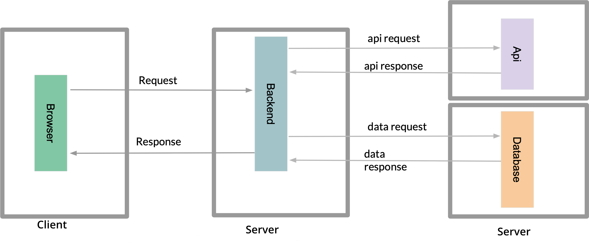
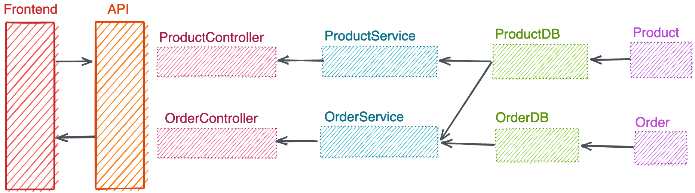
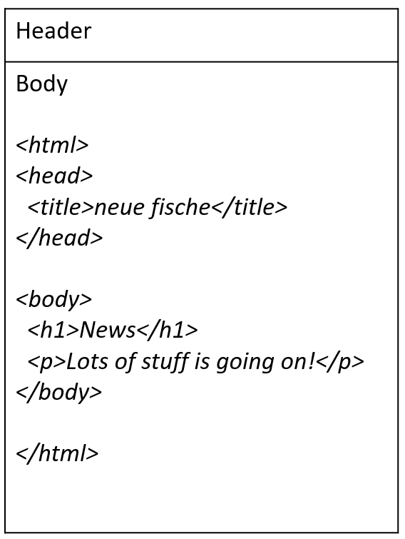
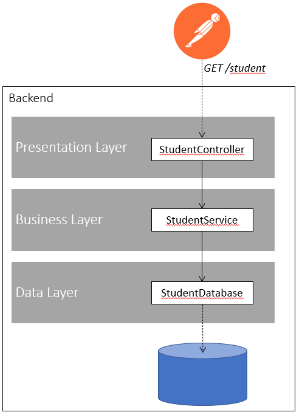
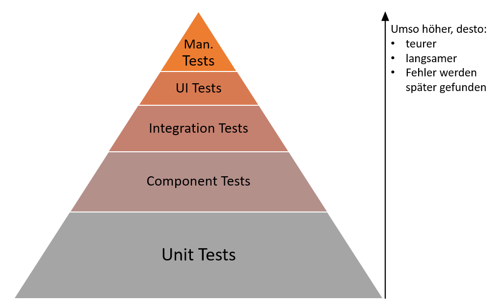
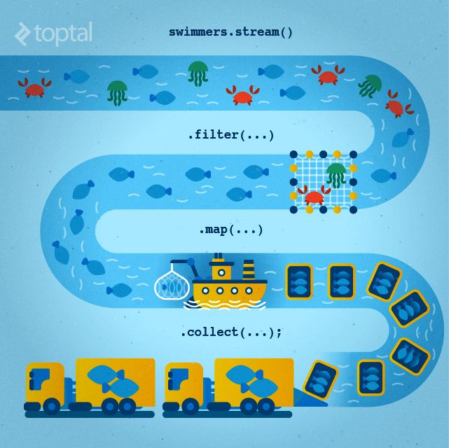

# Woche 3

---

## Webanwendungen

Wo stehen wir?



---

## Webanwendungen

Wo stehen wir?



---

# HTTP

---

## Hypertext Transfer Protocol

- Standard, um im WWW zu kommunizieren
- Aufruf einer URL mit
  - GET (Abfrage von Ressourcen)
  - POST (Hinzufügen einer Ressource)
  - PUT (Ändern/ Hinzufügen einer Ressource)
  - DELETE (Löschen einer Ressource)
- URL = Uniform Resource Location

---

## URL

[https://www.google.com/search?q=neuefische](https://www.google.com/search?q=neuefische)

- Path
  - www.google.com/search
- Protokoll
  - https
- Parameter
  - q = neuefische

---

<!-- _class: hsplit-->

## Body

- Senden/Empfangen von Daten
- Gut zu wissen: ein GET Request hat keinen Body 



---

## Header

- Mitgeben von Zusatzinformationen
  - Authorization
  - Content
  - etc pp

---

<!-- _class: hsplit-->

## JSON (JavaScript Object Notation)

- Repräsentation von Daten
- Objekt { … }
  - properties mit value
  - “name” : “Frank”
  - “age” : 29
- Array von Objekten [{ … }, { … } ]
- Property values können wieder Objekte/Arrays sein

```json
[
    {
        "Country": "Germany",
        "CountryCode": "DE",
        "Province": "",
        "City": "",
        "CityCode": "",
        "Lat": "51.17",
        "Lon": "10.45",
        "Cases": 178473,
        "Status": "confirmed",
        "Date": "2020-05-20T00:00:00Z",
    },
    {
        "Country": "Germany",
        "CountryCode": "DE",
        "Province": "",
        "City": "",
        "CityCode": "",
        "Lat": "51.17",
        "Lon": "10.45",
        "Cases": 179021,
        "Status": "confirmed",
        "Date": "2020-05-21T00:00:00Z",
    },
];
```

---

## Postman

- GET Request im Browser sind umständlich: 
  
  https://api.predic8.de/shop/products/


- Postman erleichtert Umgang mit Rest APIs 
  - Download: [https://www.postman.com/downloads/](https://www.postman.com/downloads/)
  - vereinfacht Requests
  - ermöglicht Workspaces

---

## Aufgabe REST Postman

Corona API: https://documenter.getpostman.com/view/10808728/SzS8rjbc

1.  Lade die Corona API Dokumentation in deinen Postman
2.  Frage die Daten für Deutschland der letzten 7 Tage ab

---

# Spring

---

<!-- _class: hsplit-->

## Spring

- Quelloffenes Framework für die Java Plattform
- Ziele
  - Vereinfachung der Java Entwicklung
  - Förderung guter Programmierpraktiken
- Open Source
- Entwickelt seit 2002


---

<!-- _class: hsplit-->

## Spring

- Riesige Bibliothek von Modulen (LDAP, Mongo, MessageQueues etc.)
- Bietet Dependency Injection


---

<!-- _class: hsplit-->

## Spring initializr

Vereinfacht Aufsetzen eines neuen Projekts.

https://start.spring.io


---

## Annotationen

- Bereits in Tests verwendet
- Klassen können auf Annotationen “gescannt” werden
  - Logik kann hinzugefügt werden
- Spring nutzt Annotationen, um Logik zu erweitern

```java
@SpringBootApplication
public class DemoApplication {

    public static void main(String[] args) {
        SpringApplication.run(DemoApplication.class, args);
    }

}
```

---

# Spring Web

---

<!-- _class: hsplit-->

## Rest Controller

- Bereitstellen von Rest Endpunkten
- `@RequestMapping`
  - gibt path an
- `@GetMapping`
  - stellt Get Rest Endpunkt bereit
  - ruft Methode auf
  - gibt Object als Json zurück

```java
@RestController
@RequestMapping("student")
public class StudentController {

    @GetMapping
    public Student getStudent(){
        return new Student("Name");
    }
}

```

---

## Aufgabe REST Controller Get

1.  Setze ein Spring Web Projekt auf
2.  Erstellt einen Web Controller `StudentController` mit einem GET Endpunkt, welcher eine Liste von Studenten zurückgibt
3.  Frage den Endpunkt mittels Postman ab

---

# Service

- Kapselung von Business Logik
- Unabhängig von Rest Endpunkt
- Logik isoliert testbar
- Wiederverwendbar

```java
@Service
public class StudentService {
  public List<Student> getStudents(){
    return ...get Students;
  }
}
```

---

## Path Variable

- "{id}" Path variable
- `@PathVariable` path variable

```java
@GetMapping(path = "{id}")
public Student getStudent(@PathVariable String id) {
    return service.getStudent(id);
}
```

---

## Request Param

- `@RequestParam` parameter
- `url?q=someName&other=value`

```java
@GetMapping
public List<Student> search(@RequestParam String q) {
    ...
}
```

---

# Post/Put Resource

- `@PostMapping` fügt POST Endpunkt hinzu
- `@PutMapping` fügt PUT Endpunkt hinzu
- `@RequestBody` Daten im request body

---

## REST Controller Post

1.  Füge einen GET Endpunkt hinzu, der einen spezifischen Studenten zurückgibt
2.  Füge einen PUT Endpunkt hinzu, um einen Studenten hinzuzufügen

---

# Dependency Injection

---

<!-- _class: hsplit-->

## Dependency Injection (DI)

- Dependency Injection Container kümmert sich um Abhängigkeiten
- Inversion of Control (IoC)

```java
@RestController
@RequestMapping("student")
public class StudentController {

 private final StudentService service;

 public StudentController(StudentService service) {
   this.service = service;
 }

 @GetMapping
 public List<Student> getStudents(){
   return service.getStudents();
 }
}


```

---

<!-- _class: hsplit-->

## Aufgabe Dependency Injection

1.  Schreibe eine Klasse `StudentService`, auf die aus dem Controller zugegriffen wird
    - nutze DI und kein `new StudentService`
2.  Schreibe eine Klasse `StudentDatabase`, welche sich um die Datenverwaltung kümmert



---

## Order Spring Server

1.  Gib alle Produkte aus
2.  Bestelle ein/mehrere Produkt/e
3.  Gib alle Bestellungen aus
4.  **Bonus**: Ermögliche nach Produktnamen zu suchen

---

# Mockito Testing

---

## Mock Unit testing

- Mocking ermöglicht unit testen
- mock(...class)
  - Verhalten kann mit `when` definiert werden
  - Aufruf kann mit `verify` sichergestellt werden

```java
ProductDb productDbMock = mock(ProductDb.class);

...

when(productDbMock.getById("someId"))
.thenReturn(Optional.of(new Product("someId", "Some Name")));

...

verify(productDbMock).getById("someId");
```

---

# Aufgabe: Unit Tests mit Mockito

- Nutze Mockito, um deine Services zu testen - ohne dabei auf die `Repo` Klassen zuzugreifen. Suche dir dafür ein passendes Projekt. 
  - Option A: StudentService 
  - Option B: ShopService

---

# Rest request Spring

---

## Rest Template

- Ansprechen von Rest Endpunkten
- Parsen von Daten / Response

```java
public ApiData getApiData() {
 RestTemplate template = new RestTemplate();
 ResponseEntity<ApiResponse> response =  template.getForEntity(API_URL, ApiResponse.class);
 return response.getBody();
}
```

---

## Aufgabe REST Template

1. Nutze das Rest Template, um Daten von der Covid API abzurufen. 
2. Stelle einen Endpunkt bereit, der zu jedem Datum die Anzahl der Covid-Infektionen ausgibt. 

---

# Spring Testing

---

## Spring context

- Testet ob context startet
- Fährt alles hoch
- Dauert lange
- Integrationstests

```java
@SpringBootTest
class ApplicationTest {

 @Test
 void contextLoads() {
 }

}
```

---

<!-- _class: hsplit-->

## Controller Integration Test

- Integrations-Test startet den Spring context
- Sendet Rest Request an Server
- Endpunkt startet mit einem zufälligen Port

```java
@SpringBootTest(webEnvironment =
  SpringBootTest.WebEnvironment.RANDOM_PORT)
class TodoControllerIntegrationTest {
 @LocalServerPort
 private int port;

 @Autowired
 private TestRestTemplate restTemplate;

...

// WHEN
ResponseEntity<TodoItem> response =
  restTemplate.postForEntity(
    new URL(baseUrl()).toString(),
    new AddTodoItemData("some description"),
    TodoItem.class);
```

---

## Controller Test

- Schreibe für deinen Covid Controller Integrations-Tests

---

## Test Inject

- Bean kann über `@Autowired` injected werden
- Bean muss im Context sein

```java
@SpringBootTest(classes = TodoService.class)
class TodoServiceTest {

 @Autowired
 TodoService todoService;
```

---

## Mock Bean Inject

- Beans können gemockt werden
- Definition von Verhalten über `when`
- Verifizierung, ob Aufruf stattgefunden hat

```java
@MockBean
TodoRepository repository;


when(repository.findById("someId"))
.thenReturn(Optional.of(value));


verify(repository).save(
  eq(new TodoItem("someId", "some desc", TodoStatus.DONE)));
```

---

## Mock Bean

Schreibe Tests für deinen Corona-Service, indem du

- den Service über Autowire in deinen Test einbindest
- für die Api Anbindung eine MockBean verwendest
- verifizierst, dass die Api Klasse aufgerufen wird
- verifizierst, dass die Daten korrekt zurückgegeben werden

---
<!-- _class: hsplit-->
## Integration vs Unit test

<div>
Integration Test:

  - fährt Server/Context hoch
  - dauert länger
  - testet Zusammenspiel von Software Komponenten
</div>
<div>
Unit Test:

  - testet kleinen Teil
  - fährt Server nicht hoch
  - sehr schnell
  - testet nicht das Zusammenspiel von Software Komponenten
</div>

--- 

## Test-Pyramide



---

# Swagger

---

## Swagger client

- Swagger gibt Übersicht über Endpunkte
- [https://swagger.io/tools/swagger-ui/](https://swagger.io/tools/swagger-ui/)
- Ausführung ähnlich zu Postman

---

<!-- _class: hsplit-->

## Swagger Setup

<div>

- Maven dependency
- Config
- [http://localhost:8080/swagger-ui.html](http://localhost:8080/swagger-ui.html)


```xml
<dependency>
   <groupId>io.springfox</groupId>
   <artifactId>springfox-swagger2</artifactId>
   <version>2.9.2</version>
</dependency>
<dependency>
   <groupId>io.springfox</groupId>
   <artifactId>springfox-swagger-ui</artifactId>
   <version>2.9.2</version>
</dependency>
```

</div>


```java
@Configuration
@EnableSwagger2
public class SwaggerConfig {

 @Bean
 public Docket api(){
 return new Docket(DocumentationType.SWAGGER_2)
     .select()
     .apis(RequestHandlerSelectors.any())
     .paths(PathSelectors.any())
     .build();
 }
}
```
---

# Enums

---

<!-- _class: hsplit-->

## Enum

- feste Anzahl von Ausprägungen
- häufig mit switch
- Ausprägungen können Member und Methoden haben
- nicht public Konstruktor

```Java
public enum Directions {
   NORTH("N"),
   EAST("E"),
   SOUTH("S"),
   WEST("W");

   public final String abbreviation;

   Directions(String abbreviation){
       this.abbreviation = abbreviation;
   }
}
```

---

## Aufgabe: Enums

Refactor die Alarm-Klasse aus Woche 1 und nutze ein Enum statt String-Konstanten.

---

# Generics

---

## Generic function

- Ermöglicht Methode für unterschiedliche Objekte zu schreiben
- Angabe durch Type-Parameter `<T>`
- Buchstabe frei wählbar, best practice: T,U,V..
- `T extends Student` => T muss Interface oder Klasse `Student` implementieren

```Java
List list = new ArrayList();
        list.add("hello");
        String s = (String) list.get(0);
```
```Java
List<String> list = new ArrayList<String>();
        list.add("hello");
        String s = list.get(0);   // no cast
```

---

## Generic Class/Interface

Ermöglicht Klassen für mehrere Objekte zu definieren.

```Java
public class HashMap<K,V>
```

---

## Aufgabe: Generics

1. Schaue dir die ArrayList und HashMap Klassen an und versuche nachzuvollziehen wie Generics verwendet werden
2. Schreibe deine LinkedList so um, dass sie Generics verwendet und somit jedes Objekt verwalten kann

---

# Java Streams

---

## Übersicht

- Seit Java 1.8
- Operationen auf Iterable
- Functional Programming (FP) Ansatz

```java
list.stream().filter(element -> element.contains("sub"));
```

---

## Stream Methods

`filter`, `map`, `collect`, `forEach`, `findFirst`, `peek`, `sorted`, `min`, `max`, `distinct`, and *many* more, see [Stream API](https://docs.oracle.com/en/java/javase/15/docs/api/java.base/java/util/stream/Stream.html)


Quelle: toptal

---

## Aufgabe: Streams

1. Nutze Streams um die `for` loops in der OrderDb zu ersetzen.
2. Stelle einen Endpunkt um Produkte nach ihrem Namen zu suchen bereit, nutze die `filter` Methode.

---

## Aufgabe: ToDo - Backend

1.  Mache ein `fork` vom todo repo
2.  Setze ein Spring Projekt im Unterordner `backend` auf
3.  Installiere dir `node` um das Frontend bauen zu können
4.  Baue das Frontend mittels des shell scripts
5.  Starte den Server und rufe ihn im Browser auf
6.  Versuche herauszufinden, welche Endpunkte das Frontend anspricht.
7.  Implementiere die entsprechende Backendlogik in deinem Spring server
