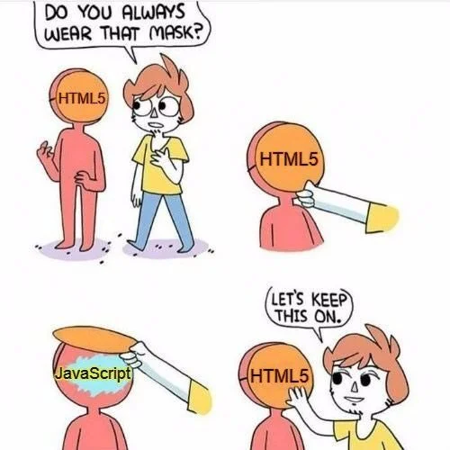
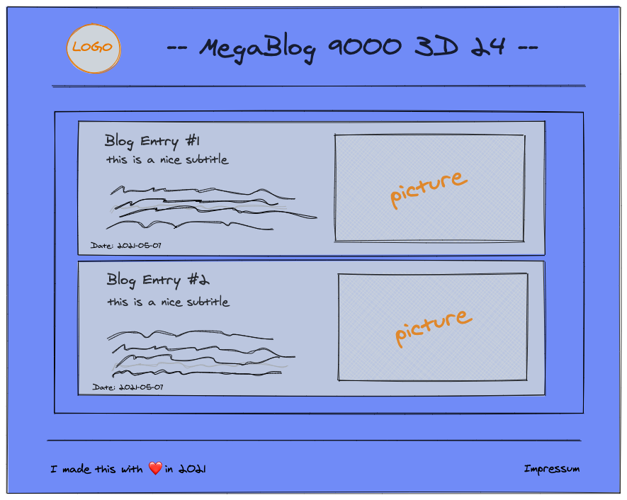
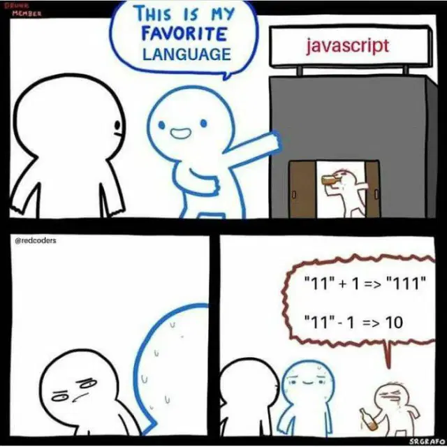

# Frontend intro

---

## Wochenübersicht

**Montag:** Besprechung Freitagsaufgabe, HTML, CSS intro, Layout: flexbox & grid

**Dienstag:** JavaScript, Array-Methoden, Netzwerkrequests, Promises & async/await

**Mittwoch:** Create react app, functional components, Data flow

**Donnerstag:** Formulare, mapping, fetch

**Freitag:** Kanban Frontend

---


---

# **H**yper**t**ext **M**arkup **L**anguuage



- Auszeichnungsprache
- beschreibt den Inhalt einer Seite
- XML ähnliche Tags
- `<h1>Fancy heading</h1>`
- Let's explore some HTML on [mdn](https://developer.mozilla.org/en-US/docs/Learn/HTML/Introduction_to_HTML/Getting_started)

---

## Website tooling

- **npm** node package manager, kommt mit node Installation
- `npm init` - legt ein neues npm project an
- `npm install --save-dev vite` - installiert vite bundler
- start script in `package.json` hinzufügen
  ```json
      "start": "vite",
  ```
- `index.html` anlegen
- `npm run start` & BÄM Hot-Reloading

---

## Aufgabe: Personal Blog

- Erstelle einen Blog
- Wird ohne CSS etwas grotesk aussehen, ist aber okay. Wir konzentrieren uns auf korrekte Verschachtelung und Semantik
- www.allthetags.com hilft dir die passenden Tags zu finden ;)



---

# **C**ascading **S**tyle **S**heets


---

## CSS-Dateien

Einbinden über `link` Tag im `head` des html Dokuments.

```html
<link rel="stylesheet" href="css/style.css" />
```

**Alternativen:**

- `style` Tag im `head` (gut um FOUC zu verhindern)
- inline über `style` Attribut von HTML Elementen (beste Performance, aber hohe Maintenance-Kosten - nur wenn unbedingt notwendig)

---

<!-- _class: hsplit-->

## Rulesets

**Selectors** wählen 1 oder mehrere Elemente aus und wenden darauf verschiedene **Rules** an.

```css
body {
  font-size: 112.5%;
  font-family: sans-serif;
  background: #333;
  color: whitesmoke;
}

.box {
  width: 100px;
  height: 100px;
  background: hotpink;
  border: 25px solid limegreen;
}

.border-box {
  box-sizing: border-box;
}

.content-box {
  box-sizing: content-box;
}
```

---

## Selectors: Let's play a game

Spiele das köstliche [CSS Diner](https://flukeout.github.io/) um dich mit den verschiedenen Selektoren vertraut zu machen!

Wenn du nicht weiterkommst: [mdn is dein Freund](https://developer.mozilla.org/en-US/docs/Web/CSS/CSS_Selectors)

---

## Layout I: Alles auf die Reihe kriegen (Flexbox)

Spiele https://flexboxfroggy.com/ um dich mit flexbox vertraut zu machen.

- https://css-tricks.com/snippets/css/a-guide-to-flexbox/

---

## Layout II: Hinter Gittern (Grid)

Lerne grid layout mit https://cssgridgarden.com/

- https://css-tricks.com/snippets/css/complete-guide-grid/

---

## Aufgabe: Blog stylen 🌈

Verpasse deinem Blog ein Layout und ordentlich Farbe!

Placeholder für die Bilder findest du bei

- https://source.unsplash.com/200x400?capybara

---

# JS

- **J**ava**S**cript oder ECMA-Script

- Standartisierte Versionen, ES2020, ESNext

- schwach typisierte, dynamische Skriptsprache



---

## JS for Java Developers

[Language Basics Demo](https://codepen.io/jamarob/pen/mdWyXLz)

**Ressourcen:**

- [MDN: Javascript Referenz](https://developer.mozilla.org/en-US/docs/Web/JavaScript)
- [The Modern Javascipt Tutorials](https://javascript.info/)

---

## JS Dateien

Einbinden über `script` Tag im `head` des HTML Dokuments

```html
<script type="module" src="js/script.js"></script>
```

`module` type ermöglicht ES module syntax (später) und verzögert das Ausführen des Skripts bis das HTML vollständig geladen ist.

---

## JS Aufgabe 1 - JS Basics

- erstelle eine `add` und `multiply` function `add`
- erstelle eine `factorial` function welche die fakultät berechnet

---

## JS Aufgabe 2 - JS Objects

- erstelle ein Studenten Object das einem namen und id hat
- erstelle einen Studenten Array
- schreibe eine function, die einen Studenten in einem Array findet und seinen Namen updated
<<<<<<< Updated upstream
- schreibe eine weitere function, die den Namen eines Studenten updated, aber das ursprüngliche Array und Object nicht ändert
=======
- verändere deinen function so, dass das urpsrüngliche Objekt nicht geändert wird, sondern ein neues erstellt wird
>>>>>>> Stashed changes

---

## JS Aufgabe 3 - Array Methods

Nutze die Daten von der [Rick and Morty](https://rickandmortyapi.com/documentation/#character) api (erstmal Antwort einfach als json speichern)

- schreibe eine function, die ein neues Array nur mit den lebenden Menschen erstellt
- schreibe eine function, die ein Array mit allen Namen zurück gibt
- schreibe eine function, die ein Array mit Objekten der Form
  ```jacascript
  {
      name: "some-name",
      origin: "name-of-origin"
  }
  ```
  zurück gibt

---

## JS Aufgabe 4 - fetch

Frage die [Rick and Morty](https://rickandmortyapi.com/api/character) api mit fetch ab und ersetzt deine statischen Daten aus Aufgabe 3
<<<<<<< Updated upstream
=======

---

# Freitagsaufgabe

Baue das Frontend der Kanban App.

1. Forke dir das repo `git@github.com:christophersiem/todo-app.git``
2. Erstelle eine neue React App im `frontend` Ordner.
3. Installiere prettier.

**Tip:** Mach dir ein Scribble vom Interface.

**Tip:** Schaue dir [axios](https://github.com/axios/axios) an und nutze es um deine Anfragen zu senden.
>>>>>>> Stashed changes
