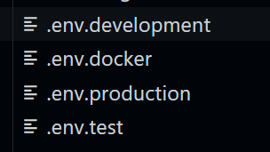

## Wochenübersicht

**Montag:** Freitagsaufgabe, Dataflow

**Dienstag:** Fehlerbehandlung beim `fetch`, Unit Tests im Frontend

**Mittwoch:** React Router, CSS Framework einbinden

**Donnerstag:** Umgebungsvariablen im Frontend, i18n, Local Storage

**Freitag:** Todo-App

---

## Dataflow

<!-- _class: hsplit -->

- von oben nach unten über props
- Von unten nach oben über Callback-Funktionen

```javascript
// Parent

export default function Parent() {
    const handleChildChange = () => {
        // do what is needed to do
    };

    return <Child onChildChange={handleChildChange} />;
}

// Child

interface ChildProps {
    onChildChange: () => void;
}

export default function Child(props: ChildProps) {
    const doSomething = () => {
        props.onChildChange();
    };

    return <button onClick={() => doSomething ()}>Click me</button>;
}
```

---

## Fehlerbehandlung beim fetch

<!-- _class: hsplit -->

```javascript
fetch(url)
    .then(response => {
        if (response.status === 200) {
            return response.json();
        }
        throw new Error('My error message');
    })
    .then(todo => setTodo(todo))
    .catch(e => setErrorMessage());
```

```java
@GetMapping("/{id}")
public Todo getToto(@PathVariable String id) {
    Todo todo = service.findById(id);        // Nehmen wir an todo ist null
    todo.performSomeMethodThatIsNecessary(); // Hier kommt es jetzt zur NullPointerException
    return todo;
}
```

---

## Aufgabe

Behandelt Fehler bei den `fetch`-Aufrufen in eurer Rick & Morty App.

---

# Unit Tests im Frontend

---

## Inhalt einer Komponente testen

<!-- _class: hsplit -->

```javascript
interface MyComponentProps {
    name: string;
}

export default function MyComponent(props: MyComponentProps) {
    return (
        <div data-testid="the-name">{props.name}</div>
    )
}
```

```javascript
import { render, screen } from '@testing-library/react';
import MyComponent from './MyComponent';

test('that component is rendered correctly', () => {
    render(<MyComponent name="André" />);

    expect(screengetByTestId('the-name').textContent).toEqual('André');
});
```

---

## Aufgabe

Schreibe einen Test, der prüft, dass in der GalleryItem-Komponente (Rick & Morty) der richtige Inhalt angezeigt wird.

---

## Interaktion mit der Komponente testen

<!-- _class: hsplit -->

```javascript
import { useState } from "react";

export default function MyInputComponent() {
    const [name, setName] = useState('');
    return (
        <div>
            <div>
                <input data-testid="name-input"
                       type="text"
                       value={name}
                       onChange={(ev) => setName(ev.target.value)} />
            </div>
            <div>
                <span data-testid="name-output">{name}</span>
            </div>
        </div>
    )
}
```

```javascript
import { render, fireEvent, screen } from '@testing-library/react';
import MyInputComponent from './MyInputComponent';

test('that component is rendered correctly', () => {
    render(<MyInputComponent />);

    const nameField = screen.getByTestId('name-input') as HTMLInputElement;
    fireEvent.change(nameField, { target: { value: 'André' } });

    expect(screen.getByTestId('name-output').textContent).toEqual('André');
});
```

---

## Mocken einen HTTP Requests

<!-- _class: hsplit -->

```javascript
import { useEffect, useState } from "react";

export default function MyHTTPComponent() {

    const [names, setNames] = useState([] as Array<string>);

    useEffect(() => {
        fetch('http://my.awesome.api')
            .then(response => response.json())
            .then((names: Array<string>) => setNames(names))
    }, [])

    return (
        <div>
            {
                names.map((name, index) =>
                    <div key={name}
                         data-testid={`name-${index}`}>
                        {name}
                    </div>)
            }
        </div>
    );
}
```

```javascript
import { render, waitFor, screen } from '@testing-library/react';
import MyHTTPComponent from './MyHTTPComponent';

test('that response is handled', async () => {
    jest.spyOn(global, 'fetch').mockImplementation(() => {
        return Promise.resolve({
            status: 200,
            json: () => Promise.resolve(['Thomas', 'André'])
        } as Response);
    });

    render(<MyHTTPComponent />);

    await waitFor(() =>{
        expect(screen.getByTestId('name-0').textContent).toEqual('Thomas');
        expect(screen.getByTestId('name-1').textContent).toEqual('André');
    });
});
```

---

## Aufgabe

Schreibt einen Test in dem ihr die Antwort der Rick & Morty API mockt und dann über das Suchfeld filtert. Stellt in dem Test sicher, dass die richtigen GalleryItems angezeigt werden.

---

## React Router

<!-- _class: hsplit -->

- Addon für React
- Verlinkt eine eingegebene Adresse mit den Unterseiten der App
- Keine echte URL, sonste würde der Browser die App nicht mehr aufrufen
- `Link` schreibt einen (pseudo-)Link
- `Route` verknüpft einen Pfad mit einer Komponente

```javascript
function MainPage() {
    return (
        <div>
            <Link to="/index">Inhalt</Link> 
            <Link to="/courses">Kurse</Link>
        </div>
    );
}

//...

function App() {
    return (
        <BrowserRouter>
            <Routes>
                <Route path="/" element={<MainPage />}>
                <Route path="index" element={<Index />} />
                <Route path="courses" element={<Courses />} />
                </Route>
            </Routes>
        </BrowserRouter>
  );
}
```

---

## Formulare

```html
<form action="/submit">
    <h2>Register here</h2>
        <div class="info">
            <input class="fname" type="text" name="name" placeholder="Full name">
            <input type="text" name="name" placeholder="Email">
            <input type="password" name="name" placeholder="Password">
            <select>
                <option value="course-type" selected>Course type*</option>
                <option value="short-courses">Short courses</option>
                <option value="featured-courses">Featured courses</option>
            </select>
        </div>
    <div>
        <input type="checkbox" name="checkbox">I agree to the Privacy Poalicy
    </div>
    <button type="submit" href="/">Submit</button>
</form>
```

---

## Formulare mit React

<!-- _class: hsplit -->

- Problem: State in React vs. Daten in Forms
- Einfach eigene Komponenten machen verletzt den Standard und kann zu Problemen führen
- Lösung: Controlled Components
  - Fangen Ereignisse im Browser
  - Synchronisieren State und Form

```javascript
function NameForm(props) {
    const [value, setValue] = useState('');

    const handleChange = (event) => {
        this.setValue(event.target.value);
    };

    const handleSubmit = (event) => {
        alert('A name was submitted: ' + value);
        event.preventDefault();
    };

    return (
        <form onSubmit={handleSubmit}>
            <label>Name:
            <input type="text" 
                   value={value} 
                   onChange={handleChange} 
            />
            </label>
            <input type="submit" value="Submit" />
        </form>
    );
}
```

---

## Aufgabe Router/Forms

1. Nutze React Router um in der Todo-App die Eingabe und Änderungen über eine eigene Seite durchzuführen.
1. Beschränke die Textlänge auf 1000 und gib einen Fehler aus wenn sie überschritten wird.

---

## Umgebungsvariablen im Frontend

<!-- _class: hsplit -->



```
REACT_APP_BASE_URL=http://localhost:8080
```

```javascript
fetch(`${process.env.REACT_APP_BASE_URL}/api/todos`)
    .then(...);
```

---

## Aufgabe

Benutze in der Todo-App Umgebungsvariablen für die Backend-URL.

---

## Local Storage in React

<!-- _class: hsplit -->

- LocalStorage speichert beliebige Daten im lokalen Browser
- Daten werden nicht automatisch auf andere Geräte übertragen
- **Kann nur Strings speichern** (JSON.stringify / JSON.parse)
- Datenmenge ist begrenzt (je nach Einstellungen 5-10 MB)
- Besser als Cookies

```javascript
const App = () => {
    const STORAGE_KEY = 'myValueKey';

    const [value, setValue] = React.useState(
        localStorage.getItem(STORAGE_KEY) || ''
    );

    React.useEffect(() => {
        localStorage.setItem(STORAGE_KEY, value);
    }, [value]);

    const onChange = event => setValue(event.target.value);

    return (
        <input value={value} type="text" onChange={onChange} />
        <p>{value}</p>
    );
};
```

---

## Aufgabe

Merke dir für die Rick & Morty App im LocalStorage die angezeigte Page um sie beim nächsten Besuch direkt wieder anzuzeigen.

---

## SCSS

<!-- _class: hsplit -->

- CSS with superpowers
- Erlaubt Variablen, Berechnungen
- Erlaubt CSS simpel zu verschachteln
- Module und Import von Snippets
- Funktionen (Mixins)

```scss
@mixin theme($theme: DarkGray) {
    background: $theme;
    box-shadow: 0 0 1px rgba($theme, .25);
    color: #fff;
}

.output {
    .info {
        @include theme;
    }
    .alert {
        @include theme($theme: DarkRed);
    }
    .success {
        @include theme($theme: DarkGreen);
    }
}
```

---

## SCSS in React

1. Installation des Packages

`$ npm install sass-loader sass`

2. In Webpack einbinden

3. Einbinden in React

`@import 'styles/colors.scss';`

---

## SCSS Aufgaben

1. Binde SCSS in die Todo-App ein
1. Versuche dein CSS durch SCSS zu verbessern
