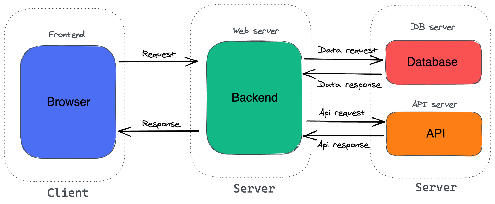
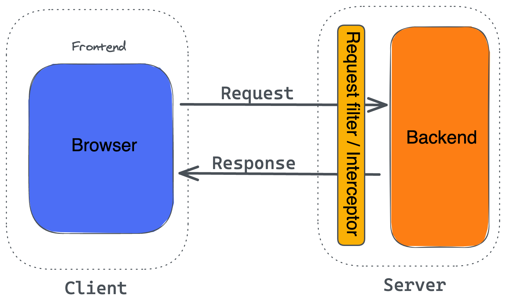
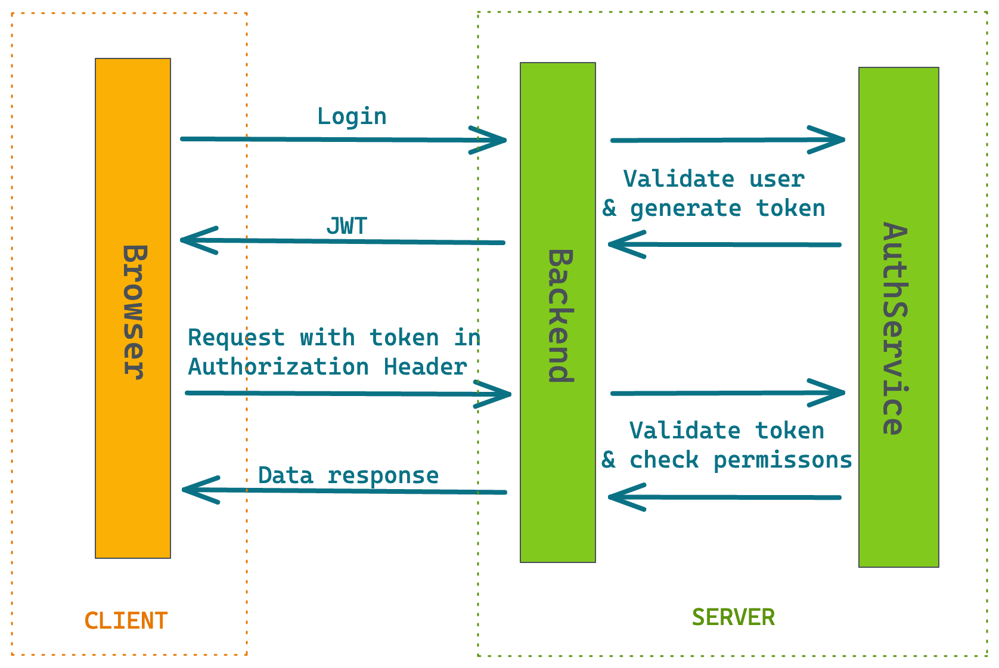

# Woche 7

---

## Wochenübersicht

- **Montag**: Freitagsaufgabe, CORS
- **Dienstag**: Spring boot security, security configuration, basic auth
- **Mittwoch**: JWT, login, protected routes, context API
- **Donnerstag**: oauth
- **Freitag**: Projektaufgabe

---

# Wo stehen wir? 🤔

---

## Webanwendung



---

# Spring boot security

---

## Einbinden

```xml
<dependency>
   <groupId>org.springframework.boot</groupId>
   <artifactId>spring-boot-starter-security</artifactId>
</dependency>
```

- Dependency reicht, um Endpunkte abzusichern.
- [Spring Guide](https://spring.io/guides/gs/securing-web/)
- [Docs](https://docs.spring.io/spring-security/site/docs/5.4.0-M1/reference/html5/)
- ([Video Tutorial](https://www.youtube.com/watch?v=sm-8qfMWEV8&list=PLqq-6Pq4lTTYTEooakHchTGglSvkZAjnE))

> user:user
> passwort: siehe logs

---

## User config

- setzen von user und passwort
- passwort **nicht** fest setzen und in git hochladen
- auch über `env` möglich

```yml
spring:
  security:
    user:
      name: admin
      password: 123456
```

---

## Aufgabe: Spring Security 1

1. Füge zu deiner Anwendung spring security hinzu
2. logge dich über die Oberfläche ein

---

# Spring Security Config

---



---

## Configure user

```java
@EnableWebSecurity
public class SecurityConfig extends WebSecurityConfigurerAdapter {

    @Override
    protected void configure(AuthenticationManagerBuilder auth) throws Exception {
    auth.inMemoryAuthentication()
        .withUser("frank")
        .password("frank1").roles("ADMIN");
    }

    @Bean
    public PasswordEncoder passwordEncoder(){
        return NoOpPasswordEncoder.getInstance();
    }

}
```

---

## Configure http

- authenticate or permit
- formLogin to show login form

```java
@EnableWebSecurity
public class SecurityConfig extends WebSecurityConfigurerAdapter {

    // more config..

    @Override
    protected void configure(HttpSecurity http) throws Exception {
        http.csrf().disabled().authorizeRequests()
            .antMatchers("/**").authenticated()
            .and().formLogin()
            .and().httpBasic();
    }

}
```

---

## Aufgabe: Spring Security 2

1. Fügt eine SecurityConfig hinzu
2. Setzt den `PasswordEncoder`
3. Konfiguriert die abgesicherten Endpunkte

---

# Spring Security mongodb

---

## Config

UserDetailsService muss konfiguriert werden.

```java
@EnableWebSecurity
public class SecurityConfig extends WebSecurityConfigurerAdapter {

    // more config...

    @Override
    protected void configure(AuthenticationManagerBuilder auth) throws Exception {
        auth.userDetailsService(userDetailsService);
    }
}
```

---

## UserDetailsService

- implement Spring Interface
- load user by name
- return Spring User

```java
@Component
public class MongoUserDetailsService implements UserDetailsService {

    private final UserRepository repository;

    public MongoUserDetailsService(UserRepository repository) {
        this.repository = repository;
    }

    @Override
    public UserDetails loadUserByUsername(String username) throws UsernameNotFoundException {
        return repository.findByUsername(username)
                .map(user -> new User(user.getUsername(), user.getPassword(), List.of(new SimpleGrantedAuthority("user"))))
                .orElseThrow(() -> new UsernameNotFoundException("User not found"));
    }
}
```

---

## Aufgabe: Spring Security 3

Nutzt einen UserDetailsService, der die User aus der Datenbank lädt.

---

## Passwörter hashen

- von Hash kann nicht auf Passwort geschlossen werden
- Hashwerte werden verglichen
- bei Datenpanne sind Passwörter nicht lesbar

```java
@Bean
public PasswordEncoder passwordEncoder() {
 return new BCryptPasswordEncoder();
}
```

---

## Principal

- beinhaltet den gerade eingeloggten User
- kann vom SecurityContextHolder abgefragt werden:
  `java SecurityContextHolder.getContext().getAuthentication() `
- Wird in Controller-Methoden automatisch vom Framework an den entsprechenden Principal Parameter weitergegeben

```java
@GetMapping("me")
public GitHubUser getLoggedInUser(Principal principal){

   String username = principal.getName();

   return userService
           .getUserByUsername(username)
           .orElseThrow();
}
```

---

## Aufgabe: Spring Security 4

- Nutze BCrypt Verschlüsselung um die Passwörter zu hashen
- Füge einen neuen GET Endpunkt /api/user/me hinzu, der den gerade eingeloggten User zurückgibt, ziehe den Namen des Users aus dem Principal.

---

# Woher weiß das Backend eigentlich wer ich bin? 🤔

---

## Session cookie

- JSESSIONID
- wird beim Aufruf gesetzt
- wird bei Requests mitgesendet

```
Cookie: JSESSIONID 1A6A3EBA81C6A738A18D736AA838587A
```

---

## Nachteile

- Cookies müssen akzeptiert werden
- Wenn Server neu startet, ist die Session nicht mehr vorhanden oder muss irgendwo abgelegt werden
- Bei mehreren Servern/Containern/Services muss die Session geteilt werden

---

# Können wir den User nicht eine art Schlüssel geben? 🤔

---

# JWT

---

<!-- _class: hsplit-->

## JSON Web Token

```json
{
 "alg": "HS256",
 "typ": "JWT"
}
{
  "sub": "1234567890",
  "name": "John Doe",
  "iat": 1516239022
}

HMACSHA256(
  base64UrlEncode(header) + "." +
  base64UrlEncode(payload),
  secret
```

```
eyJhbGciOiJIUzI1NiIsInR5cCI6IkpXVCJ9
.eyJzdWIiOiIxMjM0NTY3ODkwIiwibmFtZSI
6IkpvaG4gRG9lIiwiaWF0IjoxNTE2MjM5MDI
yfQ.SflKxwRJSMeKKF2QT4fwpMeJf36POk6y
JV_adQssw5c
```

---



---

## JSON Web Token

- Secret darf nicht an User gesendet werden
- Bei mehreren verschiedenen Services legt man meist einen Auth Service an

---

# Spring JWT

---

## Was müssen wir tun?

1. Login endpunkt bauen/erreichbar machen
2. Password validieren
3. Jwt erzeugen und zurückgeben
4. Filter erzeugen um request zu validieren

---

## Login controller bauen

- erreichbar unter `auth/login`
- AuthenticationManager kümmert sich um password Validierung
- jwtService Helper für jwt actions

```java

@RestController
@RequestMapping("auth/login")
public class LoginController {

    private final AuthenticationManager authenticationManager;
    private final JWTUtils jwtService;

    @Autowired
    public LoginController(AuthenticationManager authenticationManager, JWTUtils jwtService) {
        this.authenticationManager = authenticationManager;
        this.jwtService = jwtService;
    }

    @PostMapping
    public String login(@RequestBody LoginData data) {
        try {
            authenticationManager.authenticate(new UsernamePasswordAuthenticationToken(data.getName(), data.getPassword()));
            return jwtService.createToken(new HashMap<>(), data.getName());
        } catch (Exception e) {
            throw new ResponseStatusException(HttpStatus.BAD_REQUEST, "invalid credentials");
        }
    }
}
```

---

## AuthenticationManager

- in Spring verfügbar machen
- Bean notation um inject ausführen zu können
- Config einfügen:
  ```java
  @Override
  @Bean
  public AuthenticationManager authenticationManagerBean() throws Exception {
      return super.authenticationManagerBean();
  }
  ```

---

## JwtUtils

- io.jsonwebtoken: bietet funktion für jwt an
- javax.xml.bind: ermöglicht schneller zu signieren und ist in neuen java version(9+) **nicht standardmäßig** enthalten

```xml
<dependency>
   <groupId>io.jsonwebtoken</groupId>
   <artifactId>jjwt</artifactId>
   <version>0.9.1</version>
</dependency>
<dependency>
   <groupId>javax.xml.bind</groupId>
   <artifactId>jaxb-api</artifactId>
   <version>2.3.1</version>
</dependency>
```

---

## JWT erzeugen

- erzeugen von jwt token
- 4 Stunden valide
- Festlegen von Algorithmus

```java
@Service
public class JWTUtils {

    private final String secret = "secret-token";

    public String createToken(Map<String, Object> claims, String subject) {
        return Jwts.builder()
            .setClaims(claims)
            .setSubject(subject)
            .setIssuedAt(Date.from(Instant.now()))
            .setExpiration(Date.from(Instant.now().plus(Duration.ofHours(4))))
            .signWith(SignatureAlgorithm.HS256, secret)
            .compact();
    }
}
```

---

## Endpunkt erreichbar machen

Alle Endpunkte außer api frei zugänglich.

```java
@Override
protected void configure(HttpSecurity http) throws Exception {
    http
        .authorizeRequests()
        .antMatchers("/api/**").authenticated()
        .antMatchers("/**").permitAll();
}
```

---

## Remove session state

- Session state mit JWT nicht mehr nötig
- in config updaten

```java
@Override
protected void configure(HttpSecurity http) throws Exception {
    // more config..
    .and().sessionManagement().sessionCreationPolicy(SessionCreationPolicy.STATELESS);
}
```

---

## Filter hinzufügen

- wird bei jedem Request ausgeführt
- setzt wenn vorhanden Security Context
- auf Basis des Context kann Spring entscheiden ob Berechtigung vorliegt

---

## Filter hinzufügen

```java
@Component
public class JwtAuthFilter extends OncePerRequestFilter {

    private final JWTUtils jwtUtils;
    private final MongoUserDetailsService service;

    @Autowired
    public JwtAuthFilter(JWTUtils jwtUtils, MongoUserDetailsService service) {
        this.jwtUtils = jwtUtils;
        this.service = service;
    }

    @Override
    protected void doFilterInternal(HttpServletRequest httpServletRequest, HttpServletResponse httpServletResponse, FilterChain filterChain) throws ServletException, IOException {
        String token = getToken(httpServletRequest);
        String userName = token != null ? jwtUtils.extractUserName(token) : null;
        if (userName != null && SecurityContextHolder.getContext().getAuthentication() == null) {

            UserDetails userDetails = service.loadUserByUsername(userName);

            if (jwtUtils.validateToken(token, userDetails.getUsername())) {

                UsernamePasswordAuthenticationToken token =
               new UsernamePasswordAuthenticationToken(userDetails, null, userDetails.getAuthorities();

                token
                .setDetails(new WebAuthenticationDetailsSource().
                buildDetails(httpServletRequest));
                SecurityContextHolder.getContext().setAuthentication(token);
        }
   }
   filterChain.doFilter(httpServletRequest, httpServletResponse);
 }

 private String getToken(HttpServletRequest httpServletRequest) {
   String authHeader = httpServletRequest.getHeader("Authorization");
   if (authHeader != null) {
     return authHeader.replace("Bearer", "").trim();
   }
   return null;
 }
}
```

---

## jwt Methods

```java

public String extractUserName(String token) {
    Claims claims = extractAllClaims(token);
    return claims.getSubject();
}

private Claims extractAllClaims(String token) {
    return Jwts.parser().setSigningKey(secret).parseClaimsJws(token).getBody();
}

private Boolean isTokenExpired(String token) {
    Claims claims = extractAllClaims(token);
    return claims.getExpiration().before(new Date());
}

public Boolean validateToken(String token, String username) {
    String userName = extractUserName(token);
    return (userName.equals(username) && !isTokenExpired(token));
}
```

---

## Security context

Principal enthält Nutzerdaten

```java

@PutMapping
public Idea addToDo(@RequestBody @Valid AddIdeaDto data, Principal principal) {
```

---
