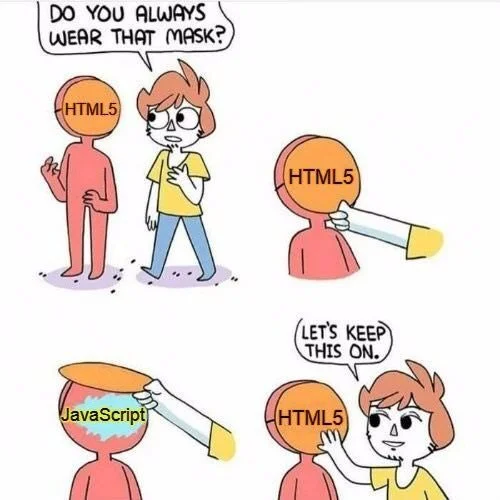
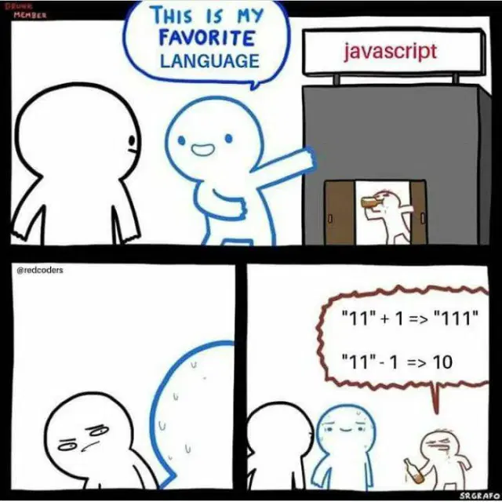

# Frontend intro

---

## Wochenübersicht

**Montag:** Besprechung Freitagsaufgabe, HTML, CSS intro, Layout: flexbox & grid

**Dienstag:** JavaScript, Array-Methoden, Netzwerk-Requests, Promises & async/await

**Mittwoch:** Create react app, functional components, Data flow

**Donnerstag:** Formulare, mapping, fetch

**Freitag:** Todo-App Frontend

---


---

# **H**yper**t**ext **M**arkup **L**anguage



- Auszeichnungsprache
- beschreibt den Inhalt einer Seite
- XML ähnliche Tags
- `<h1>Fancy heading</h1>`
- Let's explore some HTML on [mdn](https://developer.mozilla.org/en-US/docs/Learn/HTML/Introduction_to_HTML/Getting_started)

---

## Aufgabe: Personal Blog

- Erstelle einen Blog
- Wird ohne CSS etwas grotesk aussehen, ist aber okay. Wir konzentrieren uns auf korrekte Verschachtelung und Semantik
- www.allthetags.com hilft dir die passenden Tags zu finden ;)


---

# **C**ascading **S**tyle **S**heets


---

## CSS-Dateien

Einbinden über `link` Tag im `head` des html Dokuments.

```html
<link rel="stylesheet" href="css/style.css" />
```

**Alternativen:**

- `style` Tag im `head` (gut um FOUC zu verhindern)
- inline über `style` Attribut von HTML Elementen (beste Performance, aber hohe Maintenance-Kosten - nur wenn unbedingt notwendig)

---

<!-- _class: hsplit-->

## Rulesets

**Selectors** wählen 1 oder mehrere Elemente aus und wenden darauf verschiedene **Rules** an.

```css
body {
    font-size: 112.5%;
    font-family: sans-serif;
    background: #333;
    color: whitesmoke;
}

.box {
    width: 100px;
    height: 100px;
    background: hotpink;
    border: 25px solid limegreen;
}

.border-box {
    box-sizing: border-box;
}

.content-box {
    box-sizing: content-box;
}
```

---

## Selectors: Let's play a game

Spiele das köstliche [CSS Diner](https://flukeout.github.io/) um dich mit den verschiedenen Selektoren vertraut zu machen!

Wenn du nicht weiterkommst: [mdn is dein Freund](https://developer.mozilla.org/en-US/docs/Web/CSS/CSS_Selectors)

---

## Layout I: Alles auf die Reihe kriegen (Flexbox)

Spiele https://flexboxfroggy.com/ um dich mit flexbox vertraut zu machen.

- https://css-tricks.com/snippets/css/a-guide-to-flexbox/

---

## Layout II: Hinter Gittern (Grid)

Lerne grid layout mit https://cssgridgarden.com/

- https://css-tricks.com/snippets/css/complete-guide-grid/

---

## Aufgabe: Blog stylen 🌈

Verpasse deinem Blog ein Layout und ordentlich Farbe!

Placeholder für die Bilder findest du bei

- https://source.unsplash.com/200x400?capybara

---

# JS

- **J**ava**S**cript oder ECMA-Script

- Standardisierte Versionen, ES2020, ESNext

- schwach typisierte, dynamische Skriptsprache



---

## JS for Java Developers

[Language Basics Demo](https://codepen.io/cman1609/pen/qBjLPMK)

**Ressourcen:**

- [MDN: Javascript Referenz](https://developer.mozilla.org/en-US/docs/Web/JavaScript)
- [The Modern Javascript Tutorials](https://javascript.info/)

---

## JS Dateien

Einbinden über `script` Tag im `head` des HTML Dokuments

```html
<script type="text/javascript" src="js/script.js"></script>
```

---

## JS Aufgabe 1 - JS Basics

- erstelle eine `add` und `multiply` function
- erstelle eine `factorial` function welche die Fakultät berechnet

---

## JS Aufgabe 2 - JS Objects

- erstelle ein Studenten Object das einen Namen und eine Id hat
- erstelle ein Studenten Array
- schreibe eine function, die einen Studenten in einem Array findet und seinen Namen updated
- verändere deine function so, dass das ursprüngliche Objekt nicht verändert, sondern ein neues erstellt wird

---

## JS Aufgabe 3 - Array Methods

Nutze die Daten von der [Rick and Morty](https://rickandmortyapi.com/documentation/#character) API (erstmal Antwort einfach als json speichern)

- schreibe eine function, die ein neues Array nur mit den lebenden Menschen erstellt
- schreibe eine function, die ein Array mit allen Namen zurückgibt
- schreibe eine function, die ein Array mit Objekten der Form
  ```jacascript
  {
      name: "some-name",
      origin: "name-of-origin"
  }
  ```
  zurückgibt

---

<!-- _class: hsplit -->

## TypeScript

- Wurde 2012 von Microsoft entwickelt
- JavaScript mit Typen

```typescript
let i1: number;     // Der Typ wird explizit angegeben
let i2: number = 2; // Der Typ wird explizit angegeben
let i3 = 3;         // Der Typ wird automatisch inferiert


function myMethod(numericValue: number, stringValue: string = 'name'): string {
    return `${stringValue} ${numericValue}`;
}
console.log(myMethod(1, 'value')); // prints "value 1"
console.log(myMethod(2));          // prints "name 2"


enum Direction {
    TOP, DOWN, LEFT, RIGHT
}
```

---

## React

[Offizielle Dokumentation](https://reactjs.org/)
[create-react-app](https://create-react-app.dev/)
`npx create-react-app <app name> --template typescript`

---

## JS Aufgabe 4 - Komponenten

Nutze die Rick & Morty Daten um eine Gallerie der Charaktere zu erstellen.
- Schreibe eine Komponente GalleryItem, die einen Charakter als prop übergeben bekommt und darstellt.
- Schreibe eine Komponente Gallery, die die GaleryItem Komponente verwendet.
- Überlege, wie man die GalleryItem Komponente in weitere Komponenten unterteilen könnte.

---

## JS Aufgabe 5 - useState

Erstelle ein Eingabefeld um die angezeigten Charaktere filtern zu können:
- Binde in der Gallery-Komponente ein `input`-Element für den Suchbegriff ein.
- Benutze `useState` um den Suchbegriff in der Komponente zu speichern.
- Benutze den Suchbegriff um die Charaktere zu filtern.

---

## JS Aufgabe 6 - useEffect & fetch

Frage die [Rick and Morty](https://rickandmortyapi.com/api/character) API mit fetch ab und ersetze deine statischen Daten aus Aufgabe 3

---

## JS Aufgabe 7 - Paging

Nutze die Informationen aus der "Rick and Morty"-Response um zwischen den einzelnen Seiten von Charakteren zu wechseln.

---

# Freitagsaufgabe

Baue das Frontend der Todo-App.

1. Nutze das Repository in dem du letzte Woche das Backend implementiert hast
2. Setze auf die React App im `frontend` Ordner auf
3. Füge an deinem Controller die Annotation `@CrossOrigin` hinzu (das wird in der Security Woche erklärt)

**Tip:** Mach dir ein Scribble vom Interface.

**Bonus:** Schaue dir [axios](https://github.com/axios/axios) an und nutze es um deine Anfragen zu senden.
