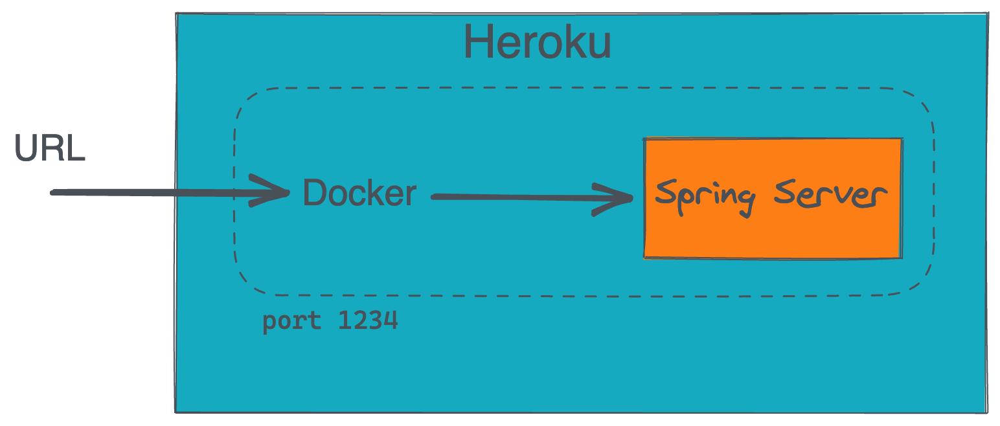

# Woche 8

---

## Heroku

- Heroku erwartet, dass Anwendung auf einem bestimmten Port startet.
- Port wird über environment variable PORT bereitgestellt
- Docker file:
  ```
  -Dserver.port=$PORT
  ```
- `heroku.yml` spezifiziert docker environment



---

## Aufgabe: Heroku

1. Erzeuge ein Dockerfile für deine Applikation
1. Installiere dir die CLI
. Lies dir die [https://devcenter.heroku.com/articles/build-docker-images-heroku-yml](_Heroku docker Getting started_) durch

4. Deploy deine Java Anwendung

---

# CD Pipeline

---

## Motivation

- Deployment should be easy
- Automation prevents errors

---

## Github Action

Führe bei einem push ein deployment aus.

```yml
on:
 push:
   branches: [ master ]

- name: Login to Heroku Container registry
 env:
   HEROKU_API_KEY: ${{ secrets.HEROKU_API_KEY }}
 run: heroku container:login
- name: Build and push
 env:
   HEROKU_API_KEY: ${{ secrets.HEROKU_API_KEY }}
 run: heroku container:push -a nf-todo-app web
- name: Release
 env:
   HEROKU_API_KEY: ${{ secrets.HEROKU_API_KEY }}
 run: heroku container:release -a nf-todo-app web

```

---